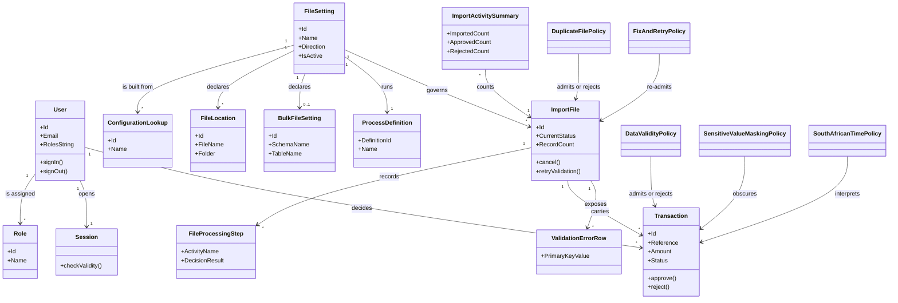

# Requirements: Transaction File Importer

**Domain:** Financial services back-office (transaction file intake and approval) — authoritative field with its resolution marker is §1 **Target:** application **Created:** 2026-08-24 **Status:** final **Last finalised at:** 2026-08-25T07:11:47Z

## Export provenance

| Field | Value |
| --- | --- |
| Source document | `requirements/requirements.md` |
| Source sha256 | `4125e127994248005e2c0baa1e08fef59ef85f0d3dc99194ccc75490cbacaff5` |
| Source status / last finalised at | `final` / `2026-08-25T07:11:47Z` |
| Exported at | `2026-08-25T09:23:33Z` |
| Produced by | `/export-application` — pure re-projection of the prototype-target document to the application audience; zero generated content |
| Input recovery | none — every fact in this document was drafted, resolved, and verified in the source pipeline |
| Citation legend | `[SRC: C-NNN]` = input-grounded claim; resolves against `requirements/draft-claims.ndjson` (verbatim source quotes) — include that file in any handoff bundle. `Supports/Enables/Enforces/Serves → §…` in the §6.1 Rationale column = derived cross-reference into the named section of this document. |
| Backend contract pointers | §6.10 uses the placeholder base `../backend/requirements.md` until a backend requirements document exists — rebind the base path on handoff. One pointer per operation; this document never restates the contract. |

> **Authoring guardrails.** Cells across §1–§10 must obey:
> - **No stack specifics.** No framework, library, vendor, product, version, or brand name in any cell. Speak in capability categories ("client-side state management", "binary blob storage tier"). Stack picks happen at code-generation time, not here.
> - **No UI layout.** §6.4 / §6.7 / §6.8 / §6.9 cells describe *what UI elements/behaviours must exist*, never *how they are arranged or styled*. Layout, component choice, and visual design are produced by a later UX design step. Exceptions: §5 may name screen-level navigation moves; §6.5 may describe role-conditional visibility states; §8 may quote consultant-supplied layout observations as input citations.
>
> Every inferred value in this document has been resolved with the consultant; the draft-time resolution markers have been stripped and the resolved values stand on their own.
>
> Citation: input-grounded cells carry a trailing `[SRC: C-NNN]` tag in the draft, backed by `requirements/draft-claims.ndjson`. The merger **retains** `[SRC:]` tags in the final doc (LLM-only audience) and strips all other markers.
>
> Field-level marking when only some sub-fields are inferred; heading-level marking when the whole item is invented. Fill every field — no blanks.

---

## 0.1 Target-mode applicability

> The `target` field on the source manifest is `prototype` (every pipeline run; auto-set at the orchestrator's Step 1b) or `application` (legacy manifests only — the drafter no longer has a consultant-chosen application emit mode). The `application` column below therefore describes the **exported** document produced by `/export-application` from the finished pipeline doc, plus the dormant legacy-manifest behaviour. Rows marked *scope-noted* are emitted in **every** pipeline doc with an application-build-guidance blockquote ("not a prototype design input"). Rows marked *content-conditional* are omitted when they have no content under either target.

| Section | `prototype` | `application` | Mode-conditional? |
| --- | --- | --- | --- |
| §1.6 Assumptions & dependencies | omitted when no assumption/dependency applies | emitted | yes — content-conditional |
| §1.7 Architectural implications | emitted (drafter-derived; scope-noted) | carried through at export | no — scope-noted |
| §1.8 Application character | emitted (voice for the app's own user-facing copy; input-stated or consultant-resolved) | carried through at export | no |
| §6.1 `Rationale` column | column emitted (optional, per-cell) | same | no |
| §6.6.1 Session UX | emitted (scope-noted) | carried through at export | no — scope-noted |
| §6.6.2 FE performance budgets | emitted (scope-noted) | carried through at export | no — scope-noted |
| §6.10 Consumed backend contracts | fixture references | pointers into the sibling backend requirements document — produced at export or under a legacy application manifest | yes — sub-block content differs |
| §7 Data shapes consumed by FE | shape sourced from fixtures | shape sourced from backend contracts | provenance label only |
| §8 Source UI references | omitted when no consultant-supplied reference exists | same | yes — content-conditional |
| §9 Key terminology | omitted unless ≥1 inconsistency flag or alternate-term usage exists (full domain glossary lives in the GLOSSARY analysis, not here) | same | yes — content-conditional |
| `## Prototype invariants` appendix | appended (the eight prototype invariants) | omitted | yes — merger conditional |
| (all other sections) | identical | identical | no |

---

## 1. Application context

**Name:** Transaction File Importer [SRC: C-001]

**Purpose / business value:** A single place where staff bring transaction files into the business, check what those files contain before anything is committed, and decide what is kept — so that only transaction data that has passed validation and human review reaches the permanent record. [SRC: C-002]

**Domain:** Financial services back-office (transaction file intake and approval)

**Business goal:** Make the standing of every received file and every transaction on it visible to the people accountable for it, and make the person who moved it identifiable. [SRC: C-003]

---

## 1.5 Scope

> §1.5 is in-scope-only. Every bucket below was either stated in the inputs or resolved with the consultant; the section defines scope, so an out-of-scope disposition would be self-referential and is not used here.

| Bucket | Items |
| --- | --- |
| In | credentials-based sign-in and session handling [SRC: C-004]; delimited-file upload against a selected file setting [SRC: C-005]; pre-commit review of imported transactions [SRC: C-006]; per-transaction approve and reject decisions [SRC: C-007]; whole-file approve and reject decisions [SRC: C-008]; mandatory rejection-reason capture [SRC: C-009]; validation-failure diagnosis [SRC: C-010]; file cancellation before the permanent record is written [SRC: C-011]; sensitive-value masking in imported data [SRC: C-012]; South African time interpretation of imported timestamps [SRC: C-013]; minimal import, approval and rejection reporting [SRC: C-014]; approved-data export for the finance team [SRC: C-015]; file-processing trace viewing [SRC: C-016]; file-setting, file-location and bulk-load-setting administration [SRC: C-017]; user and role administration [SRC: C-018]; presentation conforming to the client's existing design system [SRC: C-019] |
| Out | back-end enforcement of the file-format validation rules [SRC: C-020]; federated or external-identity sign-on [SRC: C-021]; the file backup and recovery mechanism behind a processed file [SRC: C-022] |
| Deferred | bulk re-processing of several files in one action; per-field inline correction of failed records inside the application; scheduled unattended import |

---

## 1.6 Assumptions & dependencies

> Abstract services, persona prerequisites, environment assumptions. Cells naming a product or vendor are not permitted. Omitted entirely when nothing applies (§0.1 content-conditional).

| Kind | Statement | Source |
| --- | --- | --- |
| Abstract service dependency | A backend-for-frontend authentication capability issues and invalidates the session; the frontend never holds or inspects the credential material itself. [SRC: C-023] | stated |
| Abstract service dependency | A backend transaction-management capability owns file registration, duplicate checking, import, transform, validation, load and fault logging; the frontend consumes it only as contracts. [SRC: C-024] | stated |
| Abstract service dependency | A binary blob storage tier holds the uploaded file, the retrievable data file and the bulk error file that the frontend offers for download. [SRC: C-025] | stated |
| Abstract service dependency | A process-orchestration capability supplies the named process definition each file setting runs under. [SRC: C-026] | stated |
| Persona prerequisite | Every user already holds an account with an email address, a password and at least one assigned role; the application does not perform self-registration. [SRC: C-027] | stated |
| Persona prerequisite | Format validation of an uploaded file is performed by the back end, so the user is told the outcome rather than being blocked at the point of selection. [SRC: C-028] | stated |
| Environment assumption | The application and the authentication capability share a registrable domain so that strict same-site session cookies are delivered on same-site requests. [SRC: C-029] | stated |
| Environment assumption | The finance team receives approved transaction data as an exported file rather than by signing in to this application. [SRC: C-030] | inferred |
| Environment assumption | Users work on a desktop or tablet-class screen; a design system already exists and unlisted components follow its established pattern. [SRC: C-031] | stated |

---

## 1.7 Architectural implications

> **Application-build guidance — not a prototype design input; prototype behaviour is governed by the prototype invariants — the server is simulated, validation is visual only, and the prototype chrome is a review harness.** Capability categories derived by the drafter from §6 functional requirements + §10 volumes + §6.7 reporting needs, against an inline catalogue of ≤15 categories (see `framework/agents/requirements-drafter.md > derive-architectural-implications`). Every row below was derived by the drafter and accepted by the consultant. Recommendation column is **optional** and **non-deterministic** — a stack choice belongs in the code-generation step, not here.

| Capability category | Driving requirement(s) | Recommendation (optional) |
| --- | --- | --- |
| Client-side state management | → §6.1 F-10 / → §6.1 F-12 / → §6.1 F-16 / → §6.1 F-17 |  |
| Client-side search / filtering | → §6.1 F-11 / → §6.7 RPT-01 / → §10 | in-memory index acceptable at the recorded data volume |
| Charting / visualisation capability | → §6.7 RPT-01 |  |
| Real-time updates | → §6.8 NT-02 / → §6.8 NT-03 / → §6.1 F-28 |  |
| File upload / binary blob handling | → §6.1 F-07 / → §6.1 F-24 / → §6.1 F-29 / → §6.1 F-30 | binary blob storage tier required |
| Export rendering capability | → §6.7 RPT-01 / → §6.7 RPT-02 |  |
| Notification delivery surface | → §6.1 F-08 / → §6.1 F-21 / → §6.8 NT-01 / → §6.8 NT-04 | category-level mapping to the in-app channel listed in §6.8 |
| Multi-tab / multi-window sync | → §10 / → §6.1 F-16 / → §6.1 F-18 |  |
| Audit-trail viewer | → §6.9 / → §6.1 F-27 |  |
| Role-conditional rendering | → §6.5 / → §6.1 F-16 / → §6.1 F-26 |  |

---

## 1.8 Application character

> The persona/voice of the application's **own user-facing copy** — notifications, error messages, validation messages, confirmations, empty states. Governs tone and phrasing only; what feedback exists, when it appears, and how it is structured remain governed by the standard feedback rules and the design pipelines. This is the application's voice toward its end users — not an agent character, and not a §3 persona.

**Selected character:** Careful custodian — speaks like an experienced back-office colleague who states plainly what happened to a file, what it means for the permanent record, and what the user may do next.

**Tone attributes:** precise, unhurried, accountable, respectful of the user's expertise

| Copy surface | Guidance | Example |
| --- | --- | --- |
| Notifications | Name the file and the outcome that just became true; never announce work the user did not start. | Salary run April.csv is ready to review — 20 transactions imported. |
| Errors | Say what failed, at which step, and what the user can do; never blame the user and never expose internal identifiers alone. | Validation failed at the Validate step. 3 of 20 records could not be read. You can review the failed records or retry validation. |
| Validation | State the expectation, not the violation, and keep it to one sentence per field. | A reason is required before a rejection can be recorded. |
| Confirmations | Name the object and the consequence for the permanent record, and state whether the action can be undone. | Approve all 20 transactions on Salary run April.csv? Approved transactions are committed to the permanent record. |
| Empty states | Name the thing that is absent and offer the one action that ends the emptiness. | No files have been uploaded yet. Upload a transaction file to begin. |

---

## 2. Domain model

> The BA's framing of the business domain in **ubiquitous language**, implementation-free.

### 2.1 Concepts

| Concept | Persistence | Definition (ubiquitous language) |
| --- | --- | --- |
| User | persistent | A person who signs in with an email address and a password and acts under the roles assigned to them. [SRC: C-032] |
| Role | persistent | A named grouping that decides what a user may see and do in the application. [SRC: C-033] |
| Session | policy | The authenticated period between a user signing in and signing out or being timed out, held by the back end and not readable by the application. [SRC: C-034] |
| File Setting | persistent | The configuration that decides which files are accepted, where they come from, which process runs them, and where their data is staged and finally landed. [SRC: C-035] |
| File Location | persistent | A folder-and-filename pairing that tells a file setting where a file of a given location type is found or placed. [SRC: C-036] |
| Bulk File Setting | persistent | The bulk-load parameters a file setting uses when landing a file's records into its staging table. [SRC: C-037] |
| Configuration Lookup | persistent | A named, referenceable value a file setting is built from — its source, its file type, a location type, or a bulk-load database. |
| Process Definition | persistent | The named process a file setting runs a received file through. [SRC: C-038] |
| Import File | persistent | A file received for import, tracked as one run from registration to landing or fault, carrying its own status and record count. [SRC: C-039] |
| File Processing Step | persistent | One recorded step of an import file's journey, with the activity that ran, its decision outcome, and when it started and ended. [SRC: C-040] |
| Transaction | persistent | A single money movement carried on one record of an import file, which is imported first and then approved or rejected. [SRC: C-041] |
| Validation Error Row | derived | An imported record whose values failed validation, presented with the values that caused the failure. [SRC: C-042] |
| Import Activity Summary | derived | The counts of files that were imported, approved or rejected over a period. [SRC: C-043] |
| Duplicate-File Policy | policy | A file must pass duplicate validation before its data is imported. [SRC: C-044] |
| Data-Validity Policy | policy | Data must pass validation before it is landed in the permanent record. [SRC: C-045] |
| Fix-and-Retry Policy | policy | A back-end remediation attempt may re-enter at transform and must pass validation again before landing; the application offers no user-facing retry, so a fault is resolved by cancelling the run and uploading a corrected file. [SRC: C-046] |
| Sensitive-Value Masking Policy | policy | Sensitive values carried in imported data are obfuscated when shown to a reviewer. [SRC: C-047] |
| South African Time Policy | policy | Every timestamp in a received file is read as South African time (GMT+2). [SRC: C-048] |

### 2.2 Relationships

- User **is assigned** Role [1..*]
- Role **grants access for** User to Import File, Transaction and File Setting [*..*]
- User **opens** Session [1..1 active]
- File Setting **is built from** Configuration Lookup [1..*]
- File Setting **declares** File Location [1..*]
- File Setting **declares** Bulk File Setting [0..1]
- File Setting **runs** Process Definition [1..1]
- File Setting **governs** Import File [1..*]
- Import File **records** File Processing Step [1..*]
- Import File **carries** Transaction [1..*]
- Import File **exposes** Validation Error Row [0..*]
- User **decides** Transaction [1..1 per decision]
- Import Activity Summary **counts** Import File [*..1]
- Duplicate-File Policy **admits or rejects** Import File [1..1]
- Data-Validity Policy **admits or rejects** Transaction [1..*]
- Fix-and-Retry Policy **re-admits** Import File [0..1 attempt]
- Sensitive-Value Masking Policy **obscures** Transaction [1..*]
- South African Time Policy **interprets** Transaction [1..*]

### 2.3 Aggregates & lifecycles

#### Import File

| Field | Value |
| --- | --- |
| Member concepts | Import File, File Processing Step, Transaction, Validation Error Row |
| Lifecycle states | Registered → Duplicate-checked → Imported → Transformed → Validated → Landed, with Faulted and Cancelled as terminal states |
| Key invariants | A file must pass duplicate validation before its data is imported; a file that fails validation is not imported and the run is logged as a fault; data must pass validation before it is landed; data that cannot be corrected is not landed and the run is logged as a fault; a corrected file re-enters at transform rather than at import, so remediation does not re-read the source file; a cancelled file is removed from staging before it reaches the permanent record |

#### Transaction

| Field | Value |
| --- | --- |
| Member concepts | Transaction |
| Lifecycle states | Imported → Approved, or Imported → Rejected |
| Key invariants | A transaction is imported before it can be decided; a rejection carries a stated reason recorded as the user note; every decision records the user who performed the action |

#### User

| Field | Value |
| --- | --- |
| Member concepts | User, Role |
| Lifecycle states | Active → Deleted |
| Key invariants | A user holds at least one role; every change to a user records the user who performed the action |

#### File Setting

| Field | Value |
| --- | --- |
| Member concepts | File Setting, File Location, Bulk File Setting, Configuration Lookup, Process Definition |
| Lifecycle states | Active → Inactive |
| Key invariants | A file setting names the process definition its files are run through; a file setting's locations and bulk-load settings are addressed through the setting they belong to |

### 2.4 Diagram (optional)

### 2.5 State-transition matrix

> Emitted only when ≥1 §2.3 aggregate has more than two lifecycle states. One sub-block per qualifying aggregate. Pre-condition cells may reference `→ §6.2 BR-NN`.

#### Import File

| From → To | Trigger | Pre-condition | Visible effect |
| --- | --- | --- | --- |
| (none) → Registered | The user uploads a file against a selected file setting [SRC: C-049] | A file setting is named on the upload [SRC: C-050] | The file appears in the file list with its status and no record count yet |
| Registered → Duplicate-checked | The duplicate-validation step completes [SRC: C-051] | The file has been registered [SRC: C-052] | The file's status advances and its last executed activity names the duplicate check |
| Duplicate-checked → Imported | The duplicate check passes and the import step runs [SRC: C-053] | The duplicate check returned success → §6.2 BR-02 [SRC: C-054] | The file's record count becomes visible and its transactions become listable |
| Duplicate-checked → Faulted | The duplicate check fails and the fault is logged [SRC: C-055] | The duplicate check returned failure → §6.2 BR-02 [SRC: C-056] | The file is shown as faulted with the recorded fault message and no transactions are listed |
| Imported → Transformed | The transform step runs [SRC: C-057] | The file's data has been imported [SRC: C-058] | The file's last executed activity names the transform step |
| Transformed → Validated | The validation step runs [SRC: C-059] | The file's data has been transformed [SRC: C-060] | The file's last executed activity names the validation step |
| Validated → Landed | Validation succeeds and the load step runs [SRC: C-061] | Validation returned success → §6.2 BR-03 [SRC: C-062] | The file is shown as landed and its transactions are available to decide on |
| Validated → Faulted | Validation fails, the correction does not succeed, and the fault is logged [SRC: C-064] | The correction attempt returned failure → §6.2 BR-07 [SRC: C-065] | The file is shown as faulted, the failed records are listable and the bulk error file is offered for download |
| Registered → Cancelled | The user cancels the file [SRC: C-066] | The file has not yet been landed → §6.2 BR-15 [SRC: C-067] | The file leaves the active file list and its transactions are no longer listed |
| Imported → Cancelled | The user cancels the file [SRC: C-068] | The file has not yet been landed → §6.2 BR-15 [SRC: C-069] | The file leaves the active file list and its staged transactions are no longer listed |

#### Transaction

| From → To | Trigger | Pre-condition | Visible effect |
| --- | --- | --- | --- |
| Imported → Approved | The user approves the transaction, or approves every transaction on its file in one action [SRC: C-070] | The transaction's status is Imported → §6.2 BR-14 [SRC: C-071] | The transaction's status indicator changes to approved and the approve and reject actions are no longer offered for it |
| Imported → Rejected | The user rejects the transaction with a stated reason, or rejects every transaction on its file in one action [SRC: C-072] | The transaction's status is Imported and a reason has been supplied → §6.2 BR-01 [SRC: C-073] | The transaction's status indicator changes to rejected and the stated reason becomes visible as the user note |

---

## 3. Target users

> Target-user personas — the end users of the application being designed. Not to be confused with the Unicorn (LLM) or the Consultant (audience).

### Importer

| Field | Value |
| --- | --- |
| Role / job title | Importer — brings transaction files into the business and checks them before anything is committed [SRC: C-074] |
| Expertise level | Fluent in the file format and the day-to-day import routine; not a systems specialist [SRC: C-075] |
| Stakes | Owns whether a received file's data reaches the permanent record intact; a bad import is traced back to them [SRC: C-076] |
| Frequency of use | Every working day, once per received file |
| Driving forces — wants | Get a file in, see plainly what it contains, and be told what went wrong and why when it is turned back [SRC: C-077] |
| Driving forces — fears | Committing data that should not have been committed; having to re-import a whole file because of one correctable fault [SRC: C-078] |

### Approver

| Field | Value |
| --- | --- |
| Role / job title | Approver — reviews imported files and settles what is kept [SRC: C-079] |
| Expertise level | Knows the business meaning of the transactions and the standard the data is held to; works from what the file shows [SRC: C-080] |
| Stakes | Personally accountable for every acceptance and rejection, and for the reason recorded against a rejection [SRC: C-081] |
| Frequency of use | Every working day, per file awaiting a decision |
| Driving forces — wants | Decide a whole file in one action when it is uniformly good or bad, and decide one transaction at a time when it is not [SRC: C-082] |
| Driving forces — fears | Approving something unexamined; a decision that cannot be explained later because no reason was recorded [SRC: C-083] |

---

## 4. User goals & stories

> Quality signals live on the goal (outcome-level), not the story (behaviour-level).

### 4.1 Goals catalogue

| ID | Goal statement | Quality signals | Goal kind | Layout pref (optional) | UX-pattern pref (optional) |
| --- | --- | --- | --- | --- | --- |
| G-14 | Only transaction data that has passed validation and human review reaches the permanent record, so the record can be trusted as the basis for downstream work [SRC: C-084] | No transaction reaches the permanent record without both a validation pass and a recorded human decision | top-level | — | — |
| G-15 | Anyone accountable can tell where any file or transaction stands and who moved it there, without reconstructing it from memory [SRC: C-085] | Current standing and the acting user are visible for every file and every transaction without leaving the application | top-level | — | — |
| G-16 | Only authorised people see or act on the transaction data the application holds [SRC: C-086] | Every action a user cannot perform is absent from their view rather than shown and refused | top-level | — | — |
| G-17 | A file and the data behind it stay retrievable after processing, so the people who work from it are not blocked once the run is over [SRC: C-087] | A processed file's data can still be retrieved from the application after the run has ended | top-level | — | — |
| G-18 | Users move through the whole application without relearning how it behaves, so attention stays on the data rather than on the controls [SRC: C-088] | Components outside the design system follow the existing pattern [SRC: C-089] | top-level | — | — |
| G-01 | The Approver reviews an imported file before deciding on it, so the decision rests on what the file actually contains [SRC: C-090] | A decision cannot be recorded on a file whose contents have not been made available to the decider | sub-level | — | — |
| G-02 | The Approver settles the fate of imported data — accepting it or rejecting it — so only data the business stands behind is kept [SRC: C-091] | Every imported transaction ends in an explicit accepted or rejected standing | sub-level | — | — |
| G-09 | The Importer reviews imported transactions before they are permanently saved, so nothing enters the permanent record unchecked [SRC: C-092] | The imported transactions of a file are inspectable before the file is committed | sub-level | — | — |
| G-10 | Only files of the agreed delimited format are accepted for import, so malformed material never reaches the review stage [SRC: C-093] | A file of an unaccepted format never produces a reviewable transaction listing | sub-level | — | — |
| G-13 | Every timestamp in an imported file is read as South African time, so times are not shifted by the wrong assumption [SRC: C-094] | South African time (GMT+2) [SRC: C-095] | sub-level | — | — |
| G-21 | A file that should not proceed is abandoned before it reaches the permanent record, so unwanted data never has to be unpicked afterwards [SRC: C-097] | An abandoned file leaves no transaction in the permanent record | sub-level | — | — |
| G-22 | The rules that govern which files are accepted and where they come from stay current without a code change, so a new file source does not wait on a release [SRC: C-098] | A new or changed file source is served by editing configuration inside the application | sub-level | — | — |
| G-05 | Every rejection carries a stated reason, so anyone reading the record later knows why the data was turned back [SRC: C-099] | A reason is required on every rejection, recorded as the user note [SRC: C-100] | sub-level | — | — |
| G-07 | The Importer and the Approver see how many files were imported, approved or rejected, so they can tell where the work stands without asking anyone [SRC: C-101] | Minimal reporting depth — counts only, no drill-down required [SRC: C-102] | sub-level | — | — |
| G-11 | The Importer is told what went wrong and why when an import fails, so the problem can be dealt with rather than guessed at [SRC: C-103] | A failed import names both the step that failed and the reason it failed | sub-level | — | — |
| G-25 | The Importer and the Approver trace the path a file took through processing, step by step, so a stalled or failed run can be located precisely [SRC: C-104] | Every recorded processing step of a file is retrievable in order | sub-level | — | — |
| G-26 | Every approve, reject and cancel action is attributed to the person who took it, so decisions can be accounted for later [SRC: C-105] | The acting user is recorded against each action [SRC: C-106] | sub-level | — | — |
| G-12 | Sensitive values in imported data stay out of view, so reviewing a file does not expose more than the reviewer needs [SRC: C-107] | A reviewer completes a review without any sensitive value being displayed in full | sub-level | — | — |
| G-27 | Users reach their own work by proving who they are with credentials they already hold, so access does not depend on an outside identity service [SRC: C-108] | Sign-in succeeds with an email address and a password alone | sub-level | — | — |
| G-28 | Leaving the application ends the person's access, and an expired session is apparent before work is lost, so an unattended session cannot be picked up by someone else [SRC: C-109] | An expired session is surfaced before an action is attempted against it | sub-level | — | — |
| G-29 | There is deliberate control over who may import, approve and administer, so access follows the person's actual role [SRC: C-110] | Every user's permitted actions follow from the roles assigned to them | sub-level | — | — |
| G-06 | Approved transaction data reaches the finance team, so the data gets to the people who work from it [SRC: C-111] | Approved transaction data leaves the application in a form the finance team can work from | sub-level | — | — |
| G-03 | The Approver accepts or rejects a whole file in one action, so a file that is uniformly good or bad does not have to be handled record by record [SRC: C-112] | A uniformly good or bad file is settled in a single action | interaction-level | — | — |
| G-04 | The Approver approves or rejects one transaction at a time, so a single questionable entry does not hold up the rest of the file [SRC: C-113] | A single questionable transaction is settled without touching the others | interaction-level | — | — |
| G-23 | The Importer sees exactly which records of a file failed validation, so the fault can be corrected at the record that caused it [SRC: C-114] | Each failed record is identifiable individually, with the values that caused the failure | interaction-level | — | — |

### 4.2 Stories by persona

#### Importer

##### Story: As an Importer, I want to review the transactions a file brought in before the file is permanently saved, so that nothing enters the permanent record unchecked [SRC: C-115]

| Field | Value |
| --- | --- |
| Goal | → §4.1 G-09 |
| Priority | Must |
| Objective | Open a file that has been imported and work through the transactions it carries before committing it |
| Context (frequency / expertise / stakes) | Daily, once per received file; fluent in the format; owns whether the data reaches the record intact |
| Linked task flow (optional) | → §5 Flow: Review imported transactions before permanent save |
| Acceptance criteria | Given a file whose data has been imported, when the Importer opens it, then every transaction the file carries is listed with its own standing, and the commit action is available only after the listing has been presented [SRC: C-116] |

##### Story: As an Importer, I want only files of the agreed delimited format to be accepted, so that malformed material never reaches the review stage [SRC: C-117]

| Field | Value |
| --- | --- |
| Goal | → §4.1 G-10 |
| Priority | Must |
| Objective | Submit a file of the agreed format and be turned back early when it is not one |
| Context (frequency / expertise / stakes) | Daily; knows the format; a malformed file wastes a review cycle |
| Linked task flow (optional) | → §5 Flow: Upload an import file |
| Acceptance criteria | Given a file that is not of the agreed delimited format, when the Importer submits it, then the outcome reports the format failure and no transaction listing is produced for it [SRC: C-118] |

##### Story: As an Importer, I want every timestamp in a received file read as South African time, so that times are not shifted by the wrong assumption [SRC: C-119]

| Field | Value |
| --- | --- |
| Goal | → §4.1 G-13 |
| Priority | Should |
| Objective | Read transaction dates and times as they were meant in the source file |
| Context (frequency / expertise / stakes) | Every review; a shifted time changes which day a transaction belongs to |
| Linked task flow (optional) | → §5 Flow: Review imported transactions before permanent save |
| Acceptance criteria | Given a transaction whose source timestamp is expressed in South African time, when the Importer views it, then the displayed time equals the source time and the offset applied is GMT+2 [SRC: C-120] |

##### Story: As an Importer, I want sensitive values in imported data kept out of view, so that reviewing a file does not expose more than I need [SRC: C-121]

| Field | Value |
| --- | --- |
| Goal | → §4.1 G-12 |
| Priority | Must |
| Objective | Complete a review without seeing sensitive values in full |
| Context (frequency / expertise / stakes) | Every review; over-exposure of account data is a compliance exposure |
| Linked task flow (optional) | → §5 Flow: Review imported transactions before permanent save |
| Acceptance criteria | Given a transaction carrying a sensitive value, when it is listed or opened, then that value is obfuscated rather than shown in full, and the review can still be completed [SRC: C-122] |

##### Story: As an Importer, I want to be told what went wrong and why when an import fails, so that the problem can be dealt with rather than guessed at [SRC: C-123]

| Field | Value |
| --- | --- |
| Goal | → §4.1 G-11 |
| Priority | Must |
| Objective | Understand a failed run well enough to act on it |
| Context (frequency / expertise / stakes) | Whenever a run fails; not a systems specialist; a silent failure stalls the day's work |
| Linked task flow (optional) | → §5 Flow: Diagnose a failed import |
| Acceptance criteria | Given a run that has faulted, when the Importer opens it, then the step that failed and the recorded fault message are both presented, and at least one next action is offered [SRC: C-124] |

##### Story: As an Importer, I want to see exactly which records of a file failed validation, so that the fault can be corrected at the record that caused it [SRC: C-125]

| Field | Value |
| --- | --- |
| Goal | → §4.1 G-23 |
| Priority | Should |
| Objective | Identify the individual failing records rather than the file as a whole |
| Context (frequency / expertise / stakes) | Whenever validation fails; a whole-file failure message is not actionable |
| Linked task flow (optional) | → §5 Flow: Diagnose a failed import |
| Acceptance criteria | Given a file with failed validation, when the Importer inspects it, then each failing record is listed individually with the values that caused the failure [SRC: C-126] |

##### Story: As an Importer, I want a file that should not proceed abandoned before it reaches the permanent record, so that unwanted data never has to be unpicked afterwards [SRC: C-129]

| Field | Value |
| --- | --- |
| Goal | → §4.1 G-21 |
| Priority | Should |
| Objective | Stop a file that should not have been sent, before it lands |
| Context (frequency / expertise / stakes) | Occasional; unpicking landed data is far more costly than cancelling |
| Linked task flow (optional) | → §5 Flow: Cancel a file |
| Acceptance criteria | Given a file that has not yet been landed, when the Importer cancels it, then the cancellation is confirmed before it is applied, the file leaves the active listing, and none of its transactions remain in staging [SRC: C-130] |

##### Story: As an Importer, I want to trace the path a file took through processing step by step, so that a stalled or failed run can be located precisely [SRC: C-131]

| Field | Value |
| --- | --- |
| Goal | → §4.1 G-25 |
| Priority | Should |
| Objective | See the ordered processing history of one file |
| Context (frequency / expertise / stakes) | When a run does not behave as expected; imprecise diagnosis wastes escalation |
| Linked task flow (optional) | → §5 Flow: Trace a file's processing history |
| Acceptance criteria | Given a file with recorded processing steps, when the Importer opens its history, then each step is presented in order with the activity that ran, its decision outcome, and its start and end times [SRC: C-132] |

##### Story: As an Importer, I want only validated and reviewed transaction data to reach the permanent record, so that the record can be trusted as the basis for downstream work [SRC: C-133]

| Field | Value |
| --- | --- |
| Goal | → §4.1 G-14 |
| Priority | Must |
| Objective | Ensure the commit step is reachable only after validation and review |
| Context (frequency / expertise / stakes) | Every file; the trustworthiness of the record is the whole point of the application |
| Linked task flow (optional) | → §5 Flow: Review imported transactions before permanent save |
| Acceptance criteria | Given a file whose data has not passed validation, when the Importer attempts to commit it, then the commit is not performed and the reason is reported [SRC: C-134] |

##### Story: As an Importer, I want a file and the data behind it to stay retrievable after processing, so that the people who work from it are not blocked once the run is over [SRC: C-135]

| Field | Value |
| --- | --- |
| Goal | → §4.1 G-17 |
| Priority | Must |
| Objective | Retrieve a processed file's data after the run has finished |
| Context (frequency / expertise / stakes) | After any completed run; a lost file blocks the finance handoff |
| Linked task flow (optional) | → §5 Flow: Export approved transaction data |
| Acceptance criteria | Given a file whose run has finished, when the Importer requests its data, then the stored file is returned for download and the request identifies the file by its log entry [SRC: C-136] |

##### Story: As an Importer, I want an expired session made apparent before work is lost, so that an unattended session cannot be picked up by someone else [SRC: C-137]

| Field | Value |
| --- | --- |
| Goal | → §4.1 G-28 |
| Priority | Should |
| Objective | Know the session has ended before attempting an action against it |
| Context (frequency / expertise / stakes) | Any interrupted working session; losing part-completed review work is costly |
| Linked task flow (optional) | → §5 Flow: Session start and end |
| Acceptance criteria | Given a session that is no longer valid, when the Importer returns to the application, then the invalid session is detected on load and the Importer is returned to sign-in rather than shown stale data [SRC: C-138] |

##### Story: As an Importer, I want to move through the whole application without relearning how it behaves, so that attention stays on the data rather than on the controls [SRC: C-139]

| Field | Value |
| --- | --- |
| Goal | → §4.1 G-18 |
| Priority | Must |
| Objective | Meet the same behaviour for the same kind of control everywhere |
| Context (frequency / expertise / stakes) | Continuous; inconsistency costs attention that belongs on the data |
| Linked task flow (optional) | → §5 Flow: Review imported transactions before permanent save |
| Acceptance criteria | Given a control that is not part of the existing design system, when it appears anywhere in the application, then it follows the established pattern of the design system rather than introducing a new one [SRC: C-140] |

#### Approver

##### Story: As an Approver, I want to review an imported file before deciding on it, so that the accept-or-reject decision rests on what the file actually contains [SRC: C-141]

| Field | Value |
| --- | --- |
| Goal | → §4.1 G-01 |
| Priority | Must |
| Objective | Inspect a file's contents before recording a decision on it |
| Context (frequency / expertise / stakes) | Daily, per file awaiting decision; personally accountable for the decision |
| Linked task flow (optional) | → §5 Flow: Decide on a whole file |
| Acceptance criteria | Given a file awaiting a decision, when the Approver opens it, then its transactions are presented before any decision action is offered [SRC: C-142] |

##### Story: As an Approver, I want to settle the fate of imported data by accepting or rejecting it, so that only data the business stands behind is kept [SRC: C-143]

| Field | Value |
| --- | --- |
| Goal | → §4.1 G-02 |
| Priority | Must |
| Objective | Bring every imported transaction to an explicit accepted or rejected standing |
| Context (frequency / expertise / stakes) | Daily; unsettled data is the failure mode the role exists to prevent |
| Linked task flow (optional) | → §5 Flow: Decide on a single transaction |
| Acceptance criteria | Given an imported transaction, when the Approver acts on it, then its standing becomes either approved or rejected and no third outcome is available [SRC: C-144] |

##### Story: As an Approver, I want to accept or reject a whole file in one action, so that a file that is uniformly good or bad does not have to be handled record by record [SRC: C-145]

| Field | Value |
| --- | --- |
| Goal | → §4.1 G-03 |
| Priority | Must |
| Objective | Settle a uniformly good or bad file in a single action |
| Context (frequency / expertise / stakes) | Daily; record-by-record handling of a clean file is wasted effort |
| Linked task flow (optional) | → §5 Flow: Decide on a whole file |
| Acceptance criteria | Given a file whose transactions are all awaiting a decision, when the Approver approves or rejects the whole file, then every transaction on it takes that standing after a confirmation that names the file and the count affected [SRC: C-146] |

##### Story: As an Approver, I want to approve or reject one transaction at a time, so that a single questionable entry does not hold up the rest of the file [SRC: C-147]

| Field | Value |
| --- | --- |
| Goal | → §4.1 G-04 |
| Priority | Must |
| Objective | Settle one transaction without touching its siblings |
| Context (frequency / expertise / stakes) | Daily, on mixed files; blocking a whole file for one entry delays the finance handoff |
| Linked task flow (optional) | → §5 Flow: Decide on a single transaction |
| Acceptance criteria | Given a file with one questionable transaction, when the Approver decides that transaction alone, then only that transaction changes standing and the others remain awaiting a decision [SRC: C-148] |

##### Story: As an Approver, I want every rejection to carry a stated reason, so that anyone reading the record later knows why the data was turned back [SRC: C-149]

| Field | Value |
| --- | --- |
| Goal | → §4.1 G-05 |
| Priority | Must |
| Objective | Record the reason alongside every rejection |
| Context (frequency / expertise / stakes) | Every rejection; an unexplained rejection cannot be accounted for later |
| Linked task flow (optional) | → §5 Flow: Decide on a single transaction |
| Acceptance criteria | Given a rejection with no reason supplied, when the Approver attempts to record it, then the rejection is not recorded and the missing reason is reported; given a reason, the rejection is recorded and the reason is retrievable as the user note [SRC: C-150] |

##### Story: As an Approver, I want to see how many files were imported, approved or rejected, so that I can tell where the work stands without asking anyone [SRC: C-151]

| Field | Value |
| --- | --- |
| Goal | → §4.1 G-07 |
| Priority | Should |
| Objective | Read the standing of the work at a glance |
| Context (frequency / expertise / stakes) | Daily; chasing status by asking colleagues wastes both parties' time |
| Linked task flow (optional) | → §5 Flow: View import activity report |
| Acceptance criteria | Given files in each standing, when the Approver opens the activity report, then counts of imported, approved and rejected files are presented without requiring a drill-down [SRC: C-152] |

##### Story: As an Approver, I want approved transaction data to reach the finance team, so that the data gets to the people who work from it [SRC: C-153]

| Field | Value |
| --- | --- |
| Goal | → §4.1 G-06 |
| Priority | Should |
| Objective | Hand approved data on to finance in a form they can work from |
| Context (frequency / expertise / stakes) | Per completed file; a stalled handoff blocks downstream finance work |
| Linked task flow (optional) | → §5 Flow: Export approved transaction data |
| Acceptance criteria | Given approved transactions, when the Approver exports them, then the export contains the approved transactions and excludes those still awaiting a decision or rejected [SRC: C-154] |

##### Story: As an Approver, I want to tell where any file or transaction stands and who moved it there, so that no one has to reconstruct what happened from memory [SRC: C-155]

| Field | Value |
| --- | --- |
| Goal | → §4.1 G-15 |
| Priority | Must |
| Objective | Read current standing and the responsible person together |
| Context (frequency / expertise / stakes) | Continuous; reconstructing history from memory is how accountability is lost |
| Linked task flow (optional) | → §5 Flow: Trace a file's processing history |
| Acceptance criteria | Given any file or transaction, when the Approver views it, then its current standing and the user recorded against the last change are both presented [SRC: C-156] |

##### Story: As an Approver, I want only authorised people to see or act on the transaction data held, so that the data is not exposed or altered by anyone else [SRC: C-157]

| Field | Value |
| --- | --- |
| Goal | → §4.1 G-16 |
| Priority | Must |
| Objective | Have the application withhold what my role does not permit |
| Context (frequency / expertise / stakes) | Continuous; unauthorised action on money data is the highest-cost failure |
| Linked task flow (optional) | → §5 Flow: Session start and end |
| Acceptance criteria | Given a user whose role does not permit an action, when they reach a place where that action would otherwise be offered, then the action is absent rather than presented and refused [SRC: C-158] |

##### Story: As an Approver, I want every approve, reject and cancel action attributed to the person who took it, so that decisions can be accounted for later [SRC: C-159]

| Field | Value |
| --- | --- |
| Goal | → §4.1 G-26 |
| Priority | Should |
| Objective | Have my identity recorded against each decision I make |
| Context (frequency / expertise / stakes) | Every decision; unattributed decisions cannot be defended in a review |
| Linked task flow (optional) | → §5 Flow: Decide on a single transaction |
| Acceptance criteria | Given an approve, reject or cancel action, when it is performed, then the acting user is recorded against it and is retrievable alongside the affected object [SRC: C-160] |

##### Story: As an Approver, I want to reach my own work by proving who I am with credentials I already hold, so that access does not depend on an outside identity service [SRC: C-161]

| Field | Value |
| --- | --- |
| Goal | → §4.1 G-27 |
| Priority | Must |
| Objective | Sign in with an email address and a password |
| Context (frequency / expertise / stakes) | Start of every working session; a blocked sign-in blocks the whole day |
| Linked task flow (optional) | → §5 Flow: Session start and end |
| Acceptance criteria | Given valid credentials, when the Approver signs in, then the session is established and the signed-in identity is presented; given invalid credentials, the failure message does not reveal which field was wrong [SRC: C-162] |

##### Story: As an Approver, I want the rules governing which files are accepted and where they come from kept current without a code change, so that a new file source does not wait on a release [SRC: C-163]

| Field | Value |
| --- | --- |
| Goal | → §4.1 G-22 |
| Priority | Should |
| Objective | Change file settings, locations and bulk-load parameters inside the application |
| Context (frequency / expertise / stakes) | Occasional; a wrong setting stops every import for that source |
| Linked task flow (optional) | → §5 Flow: Administer file settings |
| Acceptance criteria | Given a change to a file setting, its locations or its bulk-load parameters, when the Approver saves it, then the change takes effect for subsequent files without a release and the acting user is recorded against it [SRC: C-164] |

##### Story: As an Approver, I want deliberate control over who may import, approve and administer, so that access follows the person's actual role [SRC: C-165]

| Field | Value |
| --- | --- |
| Goal | → §4.1 G-29 |
| Priority | Should |
| Objective | Create, amend and remove users and the roles they hold |
| Context (frequency / expertise / stakes) | When someone joins, moves or leaves; stale access lets the wrong person decide on money |
| Linked task flow (optional) | → §5 Flow: Administer users and roles |
| Acceptance criteria | Given a person joining, moving or leaving, when the Approver creates, amends or removes their user record and roles, then the permitted actions of that user follow the roles now held and the acting user is recorded against the change [SRC: C-166] |

---

## 5. Task flows

### Flow: Session start and end

| Field | Value |
| --- | --- |
| Actor | → §3 Importer, Approver [SRC: C-167] |
| Trigger | The user opens the application, or chooses to leave it [SRC: C-168] |
| Steps | (open the application; the application checks whether the current session is still valid on load) → (submit email address and password; the credentials are validated and, on success, a session is established) → (land on the signed-in area; the signed-in identity is presented) → (choose to sign out; the application waits for the session to be invalidated before navigating away) [SRC: C-169] |
| Decision points | Is the session on load still valid? Are the submitted credentials accepted? [SRC: C-170] |
| Exception paths | {credentials rejected → a generic failure message that does not reveal which field was wrong → re-enter credentials}; {request body incomplete → "Username and password are required." → complete the missing field}; {session invalid on load → return to sign-in → sign in again} [SRC: C-171] |
| Role-conditional behaviour | The area the user lands on, and the actions offered there, follow the roles the user holds |

### Flow: Upload an import file

| Field | Value |
| --- | --- |
| Actor | → §3 Importer [SRC: C-172] |
| Trigger | A transaction file has been received and needs to be brought into the business [SRC: C-173] |
| Steps | (choose the file setting the file belongs to; the chosen setting is named on the upload) → (choose the file; its name is carried with the upload) → (submit the upload; the outcome is reported and the file is registered) → (the duplicate check runs; the file's standing advances or the run is faulted) [SRC: C-174] |
| Decision points | Which file setting governs this file? Did the duplicate check pass? [SRC: C-175] |
| Exception paths | {file is not of the agreed delimited format → the outcome reports the format failure → submit a correctly formatted file}; {duplicate check fails → the run is faulted and the fault message is recorded → investigate whether the file has already been imported} [SRC: C-176] |
| Role-conditional behaviour | Only a role permitted to import may reach the upload step |

### Flow: Review imported transactions before permanent save

| Field | Value |
| --- | --- |
| Actor | → §3 Importer [SRC: C-177] |
| Trigger | A file's data has been imported and is awaiting review before it is permanently saved [SRC: C-178] |
| Steps | (open the file from the file listing; the file's standing and record count are presented) → (work through the transactions the file carries; each transaction's values and standing are presented, with sensitive values obfuscated and timestamps read as South African time) → (complete the review; the commit action becomes available) → (commit the file; the outcome is reported) [SRC: C-179] |
| Decision points | Has every transaction been seen? Is the file fit to be permanently saved? [SRC: C-180] |
| Exception paths | {the file's data has not passed validation → the commit is not performed and the reason is reported → diagnose and retry the failed import}; {the file carries no transactions → the empty listing names the file and offers the return path → check the source file} [SRC: C-181] |
| Role-conditional behaviour | Only a role permitted to review may open the transaction listing |

### Flow: Decide on a whole file

| Field | Value |
| --- | --- |
| Actor | → §3 Approver [SRC: C-182] |
| Trigger | An imported file is awaiting an accept-or-reject decision and is uniformly good or uniformly bad [SRC: C-183] |
| Steps | (open the file; its transactions are presented before any decision action is offered) → (choose to accept or reject the whole file; a confirmation naming the file and the count affected is presented) → (confirm; every transaction on the file takes the chosen standing and the acting user is recorded) [SRC: C-184] |
| Decision points | Is the file uniformly good or bad, or does it need transaction-by-transaction handling? Accept or reject? [SRC: C-185] |
| Exception paths | {reject chosen with no reason supplied → the rejection is not recorded and the missing reason is reported → supply a reason}; {a transaction on the file is no longer awaiting a decision → the count affected excludes it and the exclusion is reported → review the remaining transactions} [SRC: C-186] |
| Role-conditional behaviour | Only a role permitted to approve may reach the whole-file decision actions |

### Flow: Decide on a single transaction

| Field | Value |
| --- | --- |
| Actor | → §3 Approver [SRC: C-187] |
| Trigger | One transaction on an otherwise settled file is questionable [SRC: C-188] |
| Steps | (open the file's transaction listing; each transaction's standing is presented) → (choose one transaction and choose to approve or reject it; for a rejection a reason is requested) → (confirm; only that transaction changes standing, the reason is recorded as its user note and the acting user is recorded) [SRC: C-189] |
| Decision points | Approve or reject this transaction? What reason is recorded against a rejection? [SRC: C-190] |
| Exception paths | {no reason supplied on a rejection → the rejection is not recorded and the missing reason is reported → supply a reason}; {the transaction is no longer awaiting a decision → the decision actions are not offered for it and its current standing is presented → choose another transaction} [SRC: C-191] |
| Role-conditional behaviour | Only a role permitted to approve may reach the per-transaction decision actions |

### Flow: Diagnose a failed import

| Field | Value |
| --- | --- |
| Actor | → §3 Importer [SRC: C-192] |
| Trigger | A run has faulted, or a file's validation has failed [SRC: C-193] |
| Steps | (open the faulted file; the step that failed and the recorded fault message are presented) → (inspect the failed records; each failing record is listed individually with the values that caused the failure, presented under the field definitions returned for that file) → (optionally download the bulk error file; the file is returned for download) → (cancel the run so a corrected file can be uploaded in its place) [SRC: C-194] |
| Decision points | Is the fault correctable at source? Cancel the run, or escalate it? [SRC: C-195] |
| Exception paths | {the fault cannot be corrected at source → the run stays faulted and its failed records remain listable → cancel the run or escalate}; {no bulk error file exists for the run → the download is not offered and the failed-record listing is used instead → inspect the failed records} [SRC: C-196] |
| Role-conditional behaviour | Only a role permitted to read the file may diagnose it; cancellation is gated separately |

### Flow: Cancel a file

| Field | Value |
| --- | --- |
| Actor | → §3 Importer, Approver [SRC: C-197] |
| Trigger | A file should not proceed and has not yet been landed [SRC: C-198] |
| Steps | (open the file; its standing is presented) → (choose to cancel it; a confirmation naming the file is presented and the cancel action holds focus by default) → (confirm; the file is deactivated and removed from staging, leaves the active listing, and the acting user is recorded) [SRC: C-199] |
| Decision points | Has the file already been landed? Is cancellation the right action rather than rejection? [SRC: C-200] |
| Exception paths | {the file has already been landed → the cancel action is not offered and the current standing is presented → reject the transactions instead}; {cancellation removes the file from staging and so ends the traceable staging record → the confirmation states this consequence → confirm or abandon the cancellation} [SRC: C-201] |
| Role-conditional behaviour | Only a role permitted to cancel may reach the cancel action |

### Flow: Export approved transaction data

| Field | Value |
| --- | --- |
| Actor | → §3 Approver [SRC: C-202] |
| Trigger | Approved transaction data is needed by the finance team [SRC: C-203] |
| Steps | (open the approved transactions; the approved set is presented) → (choose to export; the export is produced containing the approved transactions only) → (retrieve the produced file; it is returned for download) [SRC: C-204] |
| Decision points | Which approved transactions belong in this handoff? [SRC: C-205] |
| Exception paths | {no approved transactions exist for the chosen scope → the empty result names the scope and the export is not produced → widen the scope or settle more transactions}; {the export cannot be produced → the failure is reported with the step that failed → retry the export} |
| Role-conditional behaviour | Only a role permitted to export may reach the export action |

### Flow: View import activity report

| Field | Value |
| --- | --- |
| Actor | → §3 Importer, Approver [SRC: C-206] |
| Trigger | The user wants to know where the work stands without asking anyone [SRC: C-207] |
| Steps | (open the activity report; counts of files imported, approved and rejected are presented) → (read the counts; no drill-down is required to answer the question) [SRC: C-208] |
| Decision points | Is any standing unexpectedly high or low, warranting a look at the underlying files? [SRC: C-209] |
| Exception paths | {no files exist in any standing → the empty report names the absence and offers the upload path → upload a file}; {the counts cannot be produced → the failure is reported and the last known counts are not presented as current → retry} |
| Role-conditional behaviour | The report is available to any role permitted to read files |

### Flow: Trace a file's processing history

| Field | Value |
| --- | --- |
| Actor | → §3 Importer, Approver [SRC: C-210] |
| Trigger | A run did not behave as expected and needs to be located precisely [SRC: C-211] |
| Steps | (open the file; its current standing and last executed activity are presented) → (open its processing history; each recorded step is presented in order with the activity that ran, its decision outcome, and its start and end times) → (identify the step where the run stalled or failed) [SRC: C-212] |
| Decision points | At which step did the run stop behaving as expected? [SRC: C-213] |
| Exception paths | {no processing steps have been recorded for the file → the empty history names the file and presents its current standing instead → check whether the run has started}; {the history cannot be retrieved → the failure is reported and the file's current standing is still presented → retry} |
| Role-conditional behaviour | Available to any role permitted to read the file |

### Flow: Administer file settings

| Field | Value |
| --- | --- |
| Actor | → §3 Approver [SRC: C-214] |
| Trigger | A file source, its folders, or its bulk-load parameters have changed [SRC: C-215] |
| Steps | (open the file settings listing; every setting is presented) → (open one setting; its source, type, direction, staging and target names, process definition and active state are presented) → (amend the setting and save; the acting user is recorded) → (open the setting's locations and bulk-load settings and amend them; each is addressed through the setting it belongs to and the acting user is recorded) [SRC: C-216] |
| Decision points | Which setting governs the changed source? Does the change belong on the setting, its location, or its bulk-load parameters? [SRC: C-217] |
| Exception paths | {a required setting field is left empty → the save is not performed and the missing field is reported → complete the field}; {the setting is referenced by files already in flight → the save is confirmed with that consequence stated → confirm or abandon} [SRC: C-218] |
| Role-conditional behaviour | Only a role permitted to approve may reach the file-setting actions |

### Flow: Administer users and roles

| Field | Value |
| --- | --- |
| Actor | → §3 Approver [SRC: C-219] |
| Trigger | A person joins, changes role, or leaves [SRC: C-220] |
| Steps | (open the users listing; every user is presented with the roles they hold) → (create a user, or open an existing one; email address, first name, last name and roles are presented) → (amend and save, or remove the user; a removal is confirmed before it is applied and the acting user is recorded) → (consult the roles listing to choose the roles to assign) [SRC: C-221] |
| Decision points | Which roles does this person's actual job require? Is removal or role change the right action? [SRC: C-222] |
| Exception paths | {a required user field is left empty → the save is not performed and the missing field is reported → complete the field}; {removal is chosen for a user who has recorded decisions → the confirmation states that their recorded actions remain attributed to them → confirm or abandon} [SRC: C-223] |
| Role-conditional behaviour | Only a role permitted to approve may reach the user and role actions |

---

## 6. Requirements

### 6.1 Functional

| ID | Priority | Statement | Acceptance criteria (EARS) | Source | Rationale (optional) |
| --- | --- | --- | --- | --- | --- |
| F-01 | Must | The user can sign in by submitting an email address and a password [SRC: C-224] | When a user submits an email address and a password that are accepted, the system shall establish a session and admit the user to their work [SRC: C-225] | stated |  |
| F-02 | Must | On rejected credentials the application presents a failure message that does not disclose which submitted field was wrong [SRC: C-226] | If submitted credentials are rejected, then the system shall present a generic failure message that does not reveal which field was incorrect [SRC: C-227] | stated |  |
| F-03 | Must | The application reports an incomplete sign-in submission distinctly from rejected credentials [SRC: C-228] | If a sign-in submission is missing the email address or the password, then the system shall report that both are required without attempting authentication [SRC: C-229] | stated |  |
| F-04 | Must | The user can sign out, and the application waits for the session to be invalidated before navigating away [SRC: C-230] | When the user signs out, the system shall wait for confirmation that the session has been invalidated before navigating away [SRC: C-231] | stated |  |
| F-05 | Must | The application verifies session validity when a surface loads [SRC: C-232] | When a protected surface loads, the system shall verify session validity and, if the session is not valid, return the user to sign-in [SRC: C-233] | stated |  |
| F-06 | Should | The application presents the signed-in user's identity and the roles they hold [SRC: C-234] | While a session is valid, the system shall present the signed-in user's name and the roles held [SRC: C-235] | stated |  |
| F-07 | Must | The user can select which file setting an upload belongs to [SRC: C-236] | When the user prepares an upload, the system shall require a file setting to be selected and shall carry its identifier and name with the upload [SRC: C-237] | stated |  |
| F-08 | Must | The user can upload a transaction file against the selected file setting [SRC: C-238] | When the user submits an upload with a file setting selected and a file chosen, the system shall accept the file, carry its name with the upload, and report the outcome [SRC: C-239] | stated |  |
| F-09 | Must | The application accepts only files of the agreed delimited format for import [SRC: C-240] | If a submitted file is not of the agreed delimited format, then the system shall report the format failure and shall not produce a transaction listing for it [SRC: C-241] | stated |  |
| F-10 | Must | The user can see the received files with their current standing [SRC: C-242] | When the user opens the file listing, the system shall present each received file with its current standing, its record count and its last executed activity [SRC: C-243] | stated |  |
| F-11 | Should | The user can restrict the file listing to files that are still active [SRC: C-244] | When the user restricts the file listing by active state, the system shall present only files matching the chosen state [SRC: C-245] | stated |  |
| F-12 | Must | The user can see the transactions a file carries [SRC: C-246] | When the user opens a file whose data has been imported, the system shall list every transaction that file carries [SRC: C-247] | stated |  |
| F-13 | Must | The application presents each transaction's current standing [SRC: C-248] | While a transaction is listed, the system shall present its current standing [SRC: C-249] | stated |  |
| F-14 | Must | The application obfuscates sensitive values carried in imported data [SRC: C-250] | Where a transaction field is designated sensitive, the system shall obfuscate its value wherever the transaction is presented [SRC: C-251] | stated |  |
| F-15 | Must | The application reads every timestamp carried in a received file as South African time [SRC: C-252] | When a timestamp carried in a received file is presented, the system shall interpret it as South African time at GMT+2 [SRC: C-253] | stated |  |
| F-16 | Must | The user can approve one transaction [SRC: C-254] | When the user approves a transaction whose standing is imported, the system shall set its standing to approved and record the acting user [SRC: C-255] | stated |  |
| F-17 | Must | The user can reject one transaction, supplying a reason that is recorded against it [SRC: C-256] | When the user rejects a transaction and supplies a reason, the system shall set its standing to rejected, record the supplied reason as its user note, and record the acting user [SRC: C-257] | stated |  |
| F-18 | Must | The user can approve every transaction on a file in one action [SRC: C-258] | When the user approves a whole file, the system shall set every transaction on that file whose standing is imported to approved and record the acting user against each [SRC: C-259] | stated |  |
| F-19 | Must | The user can reject every transaction on a file in one action, supplying a reason [SRC: C-260] | When the user rejects a whole file and supplies a reason, the system shall set every transaction on that file whose standing is imported to rejected, record the reason against each, and record the acting user [SRC: C-261] | stated |  |
| F-20 | Must | The application records the acting user against every decision and every change [SRC: C-262] | When any approve, reject, cancel or configuration change is performed, the system shall record the name of the user performing the action [SRC: C-263] | stated |  |
| F-21 | Must | The application presents the recorded fault for a run that failed [SRC: C-264] | When a run has faulted, the system shall present the step that failed and the recorded fault message [SRC: C-265] | stated |  |
| F-22 | Should | The user can see the individual records of a file that failed validation [SRC: C-266] | When the user inspects a file whose validation failed, the system shall list each failing record individually with the values that caused the failure [SRC: C-267] | stated |  |
| F-23 | Should | The application presents failed records using the field definitions returned for that file [SRC: C-268] | When failed records are presented, the system shall use the field definitions returned for that file to decide which fields are visible, their labels, their alignment and their display kind [SRC: C-269] | stated |  |
| F-24 | Should | The user can download the bulk error file produced for a run [SRC: C-270] | Where a run has produced a bulk error file, the system shall offer it for download and return it as a stream [SRC: C-271] | stated |  |
| F-26 | Should | The user can cancel a file before it has been landed [SRC: C-274] | When the user cancels a file that has not been landed, the system shall deactivate it, remove it from staging, and record the acting user [SRC: C-275] | stated |  |
| F-27 | Should | The user can see the recorded processing steps of a file in order [SRC: C-276] | When the user opens a file's processing history, the system shall present each recorded step in order with the activity that ran, its decision outcome, and its start and end times [SRC: C-277] | stated |  |
| F-28 | Must | The application presents a file's current standing and its last executed activity [SRC: C-278] | While a file is presented, the system shall present its current standing and the name of its last executed activity [SRC: C-279] | stated |  |
| F-29 | Should | The user can download the data file recorded against a file log entry [SRC: C-280] | When the user requests the data file for a file log entry, the system shall return it as a stream identified by that log entry [SRC: C-281] | stated |  |
| F-30 | Should | The user can download the stored file held for a file log entry [SRC: C-282] | When the user requests the stored file for a file log entry, the system shall return it as a stream [SRC: C-283] | stated |  |
| F-31 | Should | The user can export approved transaction data for the finance team [SRC: C-284] | When the user exports approved transaction data, the system shall include only transactions whose standing is approved [SRC: C-285] | stated |  |
| F-32 | Should | The application presents counts of files imported, approved and rejected [SRC: C-286] | When the user opens the activity report, the system shall present the count of files in each of the imported, approved and rejected standings [SRC: C-287] | stated |  |
| F-33 | Should | The user can see every file setting [SRC: C-288] | When the user opens the file settings listing, the system shall present every file setting with its source, type, direction, staging and target names, process definition and active state [SRC: C-289] | stated |  |
| F-34 | Should | The user can amend an existing file setting [SRC: C-290] | When the user saves an amended file setting, the system shall apply the change and record the name of the user performing the action [SRC: C-291] | stated |  |
| F-35 | Should | The user can see the file locations declared for a file setting [SRC: C-292] | When the user opens the locations of a file setting, the system shall present every location declared for that setting with its location type, filename and folder [SRC: C-293] | stated |  |
| F-36 | Should | The user can amend an existing file location [SRC: C-294] | When the user saves an amended file location, the system shall apply the change and record the name of the user performing the action [SRC: C-295] | stated |  |
| F-37 | Should | The user can see the bulk-load settings declared for a file setting [SRC: C-296] | When the user opens the bulk-load settings of a file setting, the system shall present every bulk-load setting declared for that setting with its database, schema and table names and its record and field terminators [SRC: C-297] | stated |  |
| F-38 | Should | The user can amend an existing bulk-load setting [SRC: C-298] | When the user saves an amended bulk-load setting, the system shall apply the change and record the name of the user performing the action [SRC: C-299] | stated |  |
| F-39 | Could | The user can see the configuration lookup values a file setting is built from [SRC: C-300] | When the user builds or amends a file setting, the system shall present the available file sources, file types, file location types and bulk-load databases to choose from [SRC: C-301] | stated |  |
| F-40 | Could | The user can see the available process definitions [SRC: C-302] | When the user builds or amends a file setting, the system shall present the available process definitions to choose from [SRC: C-303] | stated |  |
| F-41 | Should | The user can see every user with the roles they hold [SRC: C-304] | When the user opens the users listing, the system shall present every user with their email address, name and the roles held [SRC: C-305] | stated |  |
| F-42 | Should | The user can create a new user [SRC: C-306] | When the user saves a new user with an email address, a name, a password and at least one role, the system shall create the user and record the name of the user performing the action [SRC: C-307] | stated |  |
| F-43 | Should | The user can open one user by identifier [SRC: C-308] | When the user opens a single user, the system shall present that user's email address, name and roles held [SRC: C-309] | stated |  |
| F-44 | Should | The user can amend an existing user [SRC: C-310] | When the user saves an amended user, the system shall apply the change and record the name of the user performing the action [SRC: C-311] | stated |  |
| F-45 | Should | The user can remove an existing user [SRC: C-312] | When the user removes a user, the system shall confirm the removal before applying it and shall record the name of the user performing the action [SRC: C-313] | stated |  |
| F-46 | Could | The user can see the available roles [SRC: C-314] | When the user assigns roles, the system shall present every available role to choose from [SRC: C-315] | stated |  |

### 6.2 Business rules

| ID | Statement (when / then) | Enforcement point | Acceptance criteria (EARS) | Source | Severity |
| --- | --- | --- | --- | --- | --- |
| BR-01 | When a rejection is recorded, then a reason must have been supplied and is stored against the transaction as its user note [SRC: C-316] | cross-layer | If a rejection is submitted without a reason, then the system shall not record the rejection and shall report that a reason is required [SRC: C-317] | consultant input | blocker |
| BR-02 | When a file is registered, then it must pass duplicate validation before its data is imported [SRC: C-318] | service | If duplicate validation fails for a file, then the system shall not import its data and shall log the run as a fault [SRC: C-319] | → §2.3 invariant | blocker |
| BR-03 | When imported data is to be landed, then it must first pass validation [SRC: C-320] | service | If validation has not returned success for a file, then the system shall not land its data [SRC: C-321] | → §2.3 invariant | blocker |
| BR-04 | When data fails validation, then one remediation attempt is available and the corrected data must pass validation again before landing [SRC: C-322] | service | When a remediation attempt succeeds, the system shall re-run transform and validation before landing the data [SRC: C-323] | → §2.3 invariant | major |
| BR-05 | When a remediation attempt succeeds, then the run re-enters at the transform step rather than at import, so the source file is not re-read [SRC: C-324] | service | When a correction succeeds, the system shall resume the run at the transform step and shall not re-read the source file [SRC: C-325] | → §2.3 invariant | major |
| BR-06 | When a file fails validation, then it is not imported and the run is logged as a fault [SRC: C-326] | service | If a file fails validation, then the system shall not import it and shall log the run as a fault [SRC: C-327] | → §2.3 invariant | blocker |
| BR-07 | When data cannot be corrected, then it is not landed and the run is logged as a fault [SRC: C-328] | service | If a remediation attempt fails, then the system shall not land the data and shall log the run as a fault [SRC: C-329] | → §2.3 invariant | blocker |
| BR-08 | When submitted credentials are rejected, then the failure message must not reveal which submitted field was wrong [SRC: C-330] | cross-layer | If authentication fails, then the system shall return a generic failure message that does not reveal which field was incorrect [SRC: C-331] | consultant input | blocker |
| BR-09 | When a file is submitted for import, then only a file of the agreed delimited format is accepted [SRC: C-332] | service | If a submitted file is not of the agreed delimited format, then the system shall reject it and report the format failure [SRC: C-333] | → §6.1 F-09 | blocker |
| BR-10 | When a timestamp carried in a received file is presented, then it is read as South African time at GMT+2 [SRC: C-334] | UI | When the system presents a timestamp carried in a received file, the system shall interpret it at GMT+2 [SRC: C-335] | consultant input | major |
| BR-11 | When a transaction field designated sensitive is presented, then its value is obfuscated [SRC: C-336] | UI | Where a transaction field is designated sensitive, the system shall obfuscate its value in every presentation of that transaction [SRC: C-337] | consultant input | blocker |
| BR-12 | When a protected surface is reached, then a valid session must be present or the user is returned to sign-in [SRC: C-338] | cross-layer | If no valid session is present when a protected surface loads, then the system shall return the user to sign-in [SRC: C-339] | → §2.1 Session | blocker |
| BR-13 | When any decision or configuration change is performed, then the name of the user performing the action is recorded against it [SRC: C-340] | cross-layer | When an action that changes a file, a transaction, a user or a setting is performed, the system shall record the name of the user performing the action [SRC: C-341] | → §2.3 invariant | blocker |
| BR-14 | When a decision is recorded on a transaction, then that transaction's standing must be imported [SRC: C-342] | cross-layer | If a transaction's standing is not imported, then the system shall not offer or accept a further decision on it [SRC: C-343] | → §2.3 invariant | major |
| BR-15 | When a file is cancelled, then it must not yet have been landed [SRC: C-344] | cross-layer | If a file has already been landed, then the system shall not offer or accept its cancellation [SRC: C-345] | → §2.3 invariant | major |
| BR-16 | When a file is committed to the permanent record, then its data must have passed validation and its transactions must have been made available for review [SRC: C-346] | cross-layer | If a file's data has not passed validation, then the system shall not commit it and shall report the reason [SRC: C-347] | → §2.3 invariant | blocker |
| BR-17 | When a user reaches a surface, then the actions offered follow the roles that user holds [SRC: C-348] | cross-layer | Where a user's roles do not permit an action, the system shall omit that action from their view rather than present it and refuse it | → §6.5 | blocker |
| BR-18 | When the user signs out, then the application waits for the session to be invalidated before navigating away [SRC: C-349] | UI | When a sign-out is requested, the system shall wait for the invalidation response before navigating away [SRC: C-350] | consultant input | major |
| BR-19 | When a run fails, then a durable record of the failure is written and remains retrievable [SRC: C-351] | data | When a run fails, the system shall write a fault record carrying the failure message and the file it belongs to [SRC: C-352] | → §2.1 Import File | major |
| BR-20 | When a file has been processed, then the received file is retained so the run can be repeated from the original | data | When a file has been processed, the system shall retain the received file in its configured backup location | → §2.1 Import File | minor |
| BR-21 | When duplicate validation runs, then the basis of comparison against previously received files is the recorded content hash of the file [SRC: C-353] | service | When a file is registered, the system shall compare its recorded content hash against those of previously received files and shall fail duplicate validation on a match | → §2.1 Duplicate-File Policy | blocker |
| BR-22 | When validation fails for some of a file's records, then the disposition applies to the whole file rather than to the individual failing records [SRC: C-354] | service | If any record of a file fails validation, then the system shall withhold the entire file from landing rather than landing the passing records | → §2.1 Data-Validity Policy | blocker |

### 6.3 Validation rules

> Field-level validation surfaced to the user as inline UI feedback (required-field markers, format hints, range/length errors). Validation timing follows the standard rule: synchronous checks report when a field is left, cross-field and asynchronous checks report on submit. Backend enforcement of business invariants belongs to §6.2 BR-NN and the sibling backend doc; this section captures the *visible* validation surface only. The `Rule → Error message` pairing is **already** in EARS event-driven form by construction ("When the field violates {rule}, the system shall show {error message}"), so the EARS convention does not re-phrase this section — its tabular shape is retained.

| Field (→ §7) | Validation type | Rule | Error message |
| --- | --- | --- | --- |
| SignInSubmission.Username | required | An email address must be supplied before the submission is sent [SRC: C-357] | Username and password are required. |
| SignInSubmission.Password | required | A password must be supplied before the submission is sent [SRC: C-358] | Username and password are required. |
| Transaction.UserNote | business-rule-ref | A reason must be supplied before a rejection is recorded → §6.2 BR-01 [SRC: C-359] | A reason is required before a rejection can be recorded. |
| ImportFile.CurrentFileName | format | The chosen file must be of the agreed delimited format → §6.2 BR-09 [SRC: C-360] | Only files in the agreed delimited format can be imported. |
| Transaction.TransactionDate | format | A transaction date must be a date and time, read at GMT+2 → §6.2 BR-10 [SRC: C-361] | This date could not be read. Dates are expected as year/month/day followed by the time. |
| Transaction.Amount | format | An amount must be a number with at most two decimal places [SRC: C-362] | This amount could not be read. Enter a number with at most two decimal places. |
| Transaction.TransactionType | enum | A transaction type must be one of the accepted credit or debit indicators [SRC: C-363] | This transaction type is not recognised. |
| Transaction.Currency | enum | A currency must be one of the accepted three-letter currency codes [SRC: C-364] | This currency code is not recognised. |
| Transaction.AccountNumber | format | An account number must match the accepted grouped-digit pattern, and is obfuscated wherever it is presented | This account number could not be read. |
| Transaction.Reference | required | A transaction reference must be present on every record [SRC: C-365] | A reference is required on every transaction. |
| User.Email | format | A user's email address must be a well-formed address [SRC: C-366] | Enter a valid email address. |
| User.Password | required | A password must be supplied when a user is created [SRC: C-367] | A password is required for a new user. |
| User.Roles | required | At least one role must be assigned to a user [SRC: C-368] | Assign at least one role to this user. |
| FileSetting.Name | required | A file setting must be named [SRC: C-369] | A name is required for this file setting. |
| FileSetting.StagingTable | required | A file setting must name the staging table its records are landed into [SRC: C-370] | A staging table is required for this file setting. |
| FileLocation.Folder | required | A file location must name the folder it refers to [SRC: C-371] | A folder is required for this location. |
| BulkFileSetting.FieldTerminator | required | A bulk-load setting must state the field terminator used in the file [SRC: C-372] | A field terminator is required for this bulk-load setting. |
| ImportFile.SettingId | required | A file setting must be selected before an upload is submitted [SRC: C-373] | Select the file setting this file belongs to. |
| ImportFile.CurrentFolder | required | A file must be chosen before an upload is submitted [SRC: C-374] | Choose a file to upload. |

### 6.4 UI feature needs

> *What UI elements and behaviours the FE must provide.* Never layout, position, framework, component name, or visual design. Phrase behaviourally ("user can filter by status", "save action is available"); do not phrase visually. Acceptance criteria stay observable-signal phrasing; EARS is reserved for §6.1 and §6.2.

| ID | Priority | Feature need | Linked (G / story / BR) | Acceptance criteria |
| --- | --- | --- | --- | --- |
| UI-01 | Must | Required fields are marked, with a single legend line for the form; where at least four fifths of fields are required, optional fields are marked instead | → §6.3 | A user can tell which fields must be completed before attempting to submit |
| UI-02 | Should | The first editable field takes focus when a create or edit form opens, except where a destructive or navigational confirmation precedes it | → §6.4 UI-13 | A keyboard user can begin typing without first moving focus |
| UI-03 | Must | Synchronous checks report when a field is left; cross-field and asynchronous checks report on submit; nothing reports while the user is still typing | → §6.3 | Leaving an invalid field reports it; typing into it does not |
| UI-04 | Must | Every listing offers page navigation and a page-size selector of 5, 10, 20 and 50 with 20 chosen by default; when the data is smaller than the page size the navigation stays present but inactive | → §6.1 F-10 / → §6.1 F-12 | The page-size selector and page navigation are present on every listing regardless of how much data it holds |
| UI-05 | Should | Every listed field can be ordered; ordering is by one field at a time, ascending on first use and descending on the next, and the chosen ordering persists for the session | → §6.1 F-10 | Choosing a field reorders the listing and the active ordering is indicated |
| UI-06 | Should | Nothing is shown for waits under 300 ms; a placeholder affordance is shown from 300 ms to 3 s; a placeholder plus a still-working message is shown beyond 3 s | → §6.4.5 | A short wait produces no flicker and a long wait produces an explanation |
| UI-07 | Must | Empty-state copy names the thing that is absent and offers the primary action that ends the emptiness | → §6.4.5 | An empty listing names the entity rather than saying no data |
| UI-08 | Should | A listing emptied by an active restriction shows the active restrictions and a clear-all action, and does not offer the creation action; a listing with no data at all does offer it | → §6.1 F-11 | Restricting a listing to nothing shows the restriction as the cause, not an invitation to create |
| UI-09 | Should | Completed actions are confirmed by a transient message that dismisses itself after four to eight seconds; state the user must acknowledge or that changes what they may do next persists until dismissed | → §6.8 | A completed decision confirms transiently; a permission or connectivity state persists |
| UI-10 | Could | Count indicators show exact counts to 99, show 99+ beyond that, and are absent at zero | → §6.8 | A count of zero shows no indicator at all |
| UI-11 | Must | Standing indicators map by intent — settled and active in green, failed and blocked in red, awaiting in amber, in-progress in blue, neutral and cancelled in grey — and always pair colour with text or an icon | → §6.1 F-13 / → §6.1 F-28 | Every standing is distinguishable without relying on colour alone |
| UI-12 | Should | Controls presented as an icon alone carry an on-hover and on-focus label and a matching accessible name, and are never used for a primary destructive action | → §6.6.5 | Every icon-only control announces its purpose to assistive technology |
| UI-13 | Must | Irreversible actions are gated by an explicit confirmation that names the affected object, with the non-destructive choice holding focus by default | → §6.1 F-18 / → §6.1 F-19 / → §6.1 F-26 / → §6.1 F-45 | Confirming names the object; the destructive choice is never the one focused on open |
| UI-14 | Must | Actions a user's roles do not permit are absent from their view rather than presented and refused | → §6.2 BR-17 / → §6.5 | A user never meets an action they cannot complete |
| UI-15 | Should | Reaching a surface directly without permission produces an in-place explanation naming the missing permission and a request-access path, not a bare failure page | → §6.2 BR-17 | Following a shared link without permission explains what is missing and what to do |
| UI-16 | Should | On an object in a settled or cancelled state, changing actions are absent and a persistent explanation states the state and what, if anything, restores editability | → §6.2 BR-14 / → §6.2 BR-15 | A settled transaction offers no decision action and explains why |
| UI-17 | Could | Forms of up to eight fields are presented as one; nine to twenty are grouped into titled sections; more than twenty are broken into sequential stages | → §6.1 F-34 / → §6.1 F-42 | A long form is broken up rather than presented as one continuous list of fields |
| UI-18 | Must | The user can choose which file setting an upload belongs to before submitting it [SRC: C-375] | → §4.1 G-10 / → §6.1 F-07 | The upload cannot be submitted until a file setting has been chosen, and the chosen setting is carried with it [SRC: C-376] |
| UI-19 | Must | The user can submit a file for import and is told the outcome of the submission [SRC: C-377] | → §4.1 G-10 / → §6.1 F-08 | Submitting produces a reported outcome naming either acceptance or the reason for refusal [SRC: C-378] |
| UI-20 | Must | The user can see the received files with each file's current standing, record count and last executed activity [SRC: C-379] | → §4.1 G-15 / → §6.1 F-10 | Every received file is listed with its standing, its record count and its last executed activity [SRC: C-380] |
| UI-21 | Should | The user can restrict the file listing to files that are still active [SRC: C-381] | → §6.1 F-11 | Choosing the active restriction presents only files in that state [SRC: C-382] |
| UI-22 | Must | The user can see the transactions a file carries, each with its own standing [SRC: C-383] | → §4.1 G-09 / → §6.1 F-12 | Opening an imported file lists every transaction it carries with that transaction's standing [SRC: C-384] |
| UI-23 | Must | Values designated sensitive are obfuscated wherever a transaction is presented [SRC: C-385] | → §4.1 G-12 / → §6.2 BR-11 | A sensitive value is never presented in full, and the review can still be completed [SRC: C-386] |
| UI-24 | Must | Timestamps carried in a received file are presented as South African time [SRC: C-387] | → §4.1 G-13 / → §6.2 BR-10 | A presented timestamp equals its source value with a GMT+2 reading applied [SRC: C-388] |
| UI-25 | Must | The user can approve or reject a single transaction [SRC: C-389] | → §4.1 G-04 / → §6.1 F-16 / → §6.1 F-17 | Acting on one transaction changes only that transaction's standing [SRC: C-390] |
| UI-26 | Must | The user can approve or reject every transaction on a file in one action [SRC: C-391] | → §4.1 G-03 / → §6.1 F-18 / → §6.1 F-19 | One action settles every transaction on the file that was awaiting a decision, and the count affected is stated before it is applied [SRC: C-392] |
| UI-27 | Must | A rejection requests a reason and cannot be recorded without one [SRC: C-393] | → §4.1 G-05 / → §6.2 BR-01 | Attempting a rejection with no reason reports the missing reason and records nothing [SRC: C-394] |
| UI-28 | Must | The user can see the step that failed and the recorded fault message for a failed run [SRC: C-395] | → §4.1 G-11 / → §6.1 F-21 | A faulted run presents both the failing step and the recorded message [SRC: C-396] |
| UI-29 | Should | The user can see each failing record of a file individually, with the values that caused the failure [SRC: C-397] | → §4.1 G-23 / → §6.1 F-22 | Each failing record is separately identifiable with its offending values [SRC: C-398] |
| UI-30 | Should | Failing records are presented using the field definitions returned for that file, honouring which fields are visible, their labels, their alignment and their display kind [SRC: C-399] | → §6.1 F-23 | The presented fields match the definitions returned for that file rather than a predetermined set [SRC: C-400] |
| UI-31 | Should | The user can retrieve the bulk error file produced for a run, when one exists [SRC: C-401] | → §6.1 F-24 | The retrieval action is offered only for a run that has produced a bulk error file [SRC: C-402] |
| UI-33 | Should | The user can cancel a file that has not been landed [SRC: C-405] | → §4.1 G-21 / → §6.2 BR-15 | Cancelling is confirmed before it is applied and the file then leaves the active listing [SRC: C-406] |
| UI-34 | Should | The user can see a file's recorded processing steps in order [SRC: C-407] | → §4.1 G-25 / → §6.1 F-27 | Each recorded step is presented in order with its activity, decision outcome and start and end times [SRC: C-408] |
| UI-35 | Should | The user can retrieve the data held for a processed file [SRC: C-409] | → §4.1 G-17 / → §6.1 F-29 / → §6.1 F-30 | Requesting a processed file's data returns it for saving [SRC: C-410] |
| UI-36 | Should | The user can export approved transaction data [SRC: C-411] | → §4.1 G-06 / → §6.1 F-31 | The export contains only transactions whose standing is approved [SRC: C-412] |
| UI-37 | Should | The user can see counts of files imported, approved and rejected [SRC: C-413] | → §4.1 G-07 / → §6.1 F-32 | The three counts are presented without requiring any further navigation [SRC: C-414] |
| UI-38 | Should | The user can maintain file settings, their locations and their bulk-load settings [SRC: C-415] | → §4.1 G-22 / → §6.1 F-33 / → §6.1 F-34 / → §6.1 F-36 / → §6.1 F-38 | A saved change takes effect for subsequent files and records the acting user [SRC: C-416] |
| UI-39 | Should | The user can maintain users and the roles they hold [SRC: C-417] | → §4.1 G-29 / → §6.1 F-41 / → §6.1 F-42 / → §6.1 F-44 / → §6.1 F-45 | A saved change to a user's roles changes what that user may do, and records the acting user [SRC: C-418] |
| UI-40 | Should | The signed-in identity and the roles held are presented while the session is valid [SRC: C-419] | → §6.1 F-06 | The signed-in user can see who they are signed in as and what roles they hold [SRC: C-420] |

#### 6.4.5 Edge, empty & error states

> The UI behaviour the user sees in non-happy-path states. Captures empty datasets, partial loads, transient errors, offline degradation, loading affordances, and permission-denied surfaces. Behavioural phrasing only — describe what the user sees and can do, not where it sits on screen.

| Surface (→ story / flow / UI-NN) | Condition | Expected UI behaviour | Recovery action |
| --- | --- | --- | --- |
| → §6.4 UI-20 file listing | empty | The listing names the absence of received files and offers the upload action [SRC: C-421] | Upload a transaction file |
| → §6.4 UI-20 file listing | partial | Files already retrieved are presented and the incompleteness is stated rather than implied by a short listing [SRC: C-422] | Wait for completion or request the listing again |
| → §6.4 UI-22 transaction listing | empty | The empty listing names the file and states that it carries no transactions [SRC: C-423] | Check the source file, or cancel the file |
| → §6.4 UI-22 transaction listing | error | The failure to retrieve the transactions is stated and the file's own standing is still presented [SRC: C-424] | Request the transactions again |
| → §5 Flow: Upload an import file | error | The refused upload states the reason for refusal and the chosen file setting is retained for a second attempt [SRC: C-425] | Submit a corrected file |
| → §5 Flow: Diagnose a failed import | error | The faulted run states the failing step and the recorded message, and offers the failing-record inspection and the bulk error file [SRC: C-426] | Cancel the run and upload a corrected file |
| → §6.4 UI-29 failing-record listing | empty | Where a run faulted without producing failing records, the absence is stated and the recorded fault message is presented instead [SRC: C-427] | Read the fault message, or retrieve the bulk error file |
| → §6.4 UI-31 bulk error file retrieval | empty | Where no bulk error file exists for the run, the retrieval action is absent rather than offered and failing [SRC: C-428] | Inspect the failing records instead |
| → §5 Flow: Decide on a single transaction | error | A decision that could not be recorded states so explicitly and the transaction's standing is presented unchanged [SRC: C-429] | Attempt the decision again |
| → §6.4 UI-27 rejection reason | error | A rejection attempted without a reason states that a reason is required and retains anything already typed [SRC: C-430] | Supply a reason and record the rejection |
| → §5 Flow: Export approved transaction data | empty | Where no approved transactions exist in the chosen scope, the absence names the scope and no export is produced [SRC: C-431] | Widen the scope, or settle more transactions |
| → §5 Flow: View import activity report | empty | Where no files exist in any standing, the report states the absence and offers the upload action [SRC: C-432] | Upload a transaction file |
| → §5 Flow: Session start and end | permission-denied | Reaching a surface the user's roles do not permit produces an in-place explanation naming the missing permission and a request-access path | Request the missing permission |
| → §6.4 UI-20 file listing | loading | Waits under 300 ms show nothing; from 300 ms a placeholder affordance is shown; beyond 3 s a still-working message accompanies it | Wait, or request the listing again |
| → §5 Flow: Review imported transactions before permanent save | offline | Loss of connectivity is stated persistently, already-retrieved transactions stay readable, and actions that would change data are absent while it persists | Restore connectivity and repeat the intended action |

### 6.5 Access control (RBAC)

> Roles-×-resources matrix. Cell values use the action vocabulary below; blanks mean "no access".

**Action vocabulary:** `C` create · `R` read · `U` update · `D` delete · `X` execute / invoke · `A` approve · `—` no access. Suffix with a BR ref for conditional access (e.g. `U†BR-07` = update gated by BR-07).

| Role (→ §3) | User | Role | Import File | File Processing Step | Transaction | Validation Error Row | Import Activity Summary | File Setting | File Location | Bulk File Setting | Configuration Lookup | Process Definition | Flow: Session start and end | Flow: Upload an import file | Flow: Review imported transactions before permanent save | Flow: Decide on a whole file | Flow: Decide on a single transaction | Flow: Diagnose a failed import | Flow: Cancel a file | Flow: Export approved transaction data | Flow: View import activity report | Flow: Trace a file's processing history | Flow: Administer file settings | Flow: Administer users and roles |
| --- | --- | --- | --- | --- | --- | --- | --- | --- | --- | --- | --- | --- | --- | --- | --- | --- | --- | --- | --- | --- | --- | --- | --- | --- |
| Importer | — | — | C R [SRC: C-433] | R [SRC: C-434] | R [SRC: C-435] | R [SRC: C-436] | R [SRC: C-437] | R [SRC: C-438] | — | — | R | — | X [SRC: C-439] | X [SRC: C-440] | X [SRC: C-441] | — | — | X [SRC: C-442] | X†BR-15 [SRC: C-443] | — | X [SRC: C-444] | X [SRC: C-445] | — | — |
| Approver | C R U D [SRC: C-458] | R [SRC: C-459] | R [SRC: C-446] | R [SRC: C-447] | R A†BR-14 [SRC: C-448] | R | R [SRC: C-449] | R U [SRC: C-462] | R U [SRC: C-463] | R U [SRC: C-464] | R [SRC: C-465] | R [SRC: C-466] | X [SRC: C-450] | — | X [SRC: C-451] | X A [SRC: C-452] | X A [SRC: C-453] | X | X†BR-15 [SRC: C-454] | X [SRC: C-455] | X [SRC: C-456] | X [SRC: C-457] | X [SRC: C-469] | X [SRC: C-470] |

### 6.6 Non-functional (FE-only)

> Frontend NFRs only. Backend availability / throughput / persistence concerns live in the sibling backend requirements doc. Every inferred value below was resolved with the consultant.

#### 6.6.1 Session UX

> **Application-build guidance — not a prototype design input; prototype behaviour is governed by the prototype invariants** (server + auth are simulated, so this policy table binds the production application, not the prototype).

| Field | Value | Source |
| --- | --- | --- |
| Idle session timeout | 15 minutes | inferred |
| Absolute session timeout | 8 hours | inferred |
| Idle warning lead-time | 60 seconds before idle sign-out | inferred |
| Re-auth scope | Approve-class actions — approving or rejecting a whole file, and approving or rejecting a single transaction | inferred |
| Account lockout messaging | After five consecutive rejected sign-in attempts the message states that the account is temporarily locked and when it will be available again, without revealing whether the account exists | inferred |
| MFA prompt scope | No additional factor is prompted for; the credentials-based sign-in is the only factor | inferred |

#### 6.6.2 Frontend performance budgets

> **Application-build guidance — not a prototype design input; prototype behaviour is governed by the prototype invariants** (the prototype is a review harness, never perf-optimised — these budgets bind the production application).

| Metric | Target | Source |
| --- | --- | --- |
| Time to interactive (p95) | p95 ≤ 2.5 s on a desktop-class connection | inferred |
| Initial bundle size budget | ≤ 300 KB compressed for the first meaningful surface | inferred |
| Render budget for largest list/table | p95 ≤ 400 ms to present a transaction listing of 10³ records | inferred |
| Time to meaningful content | p95 ≤ 1.5 s to the first readable file or transaction listing | inferred |

#### 6.6.4 Compliance UI behaviour

- Values designated sensitive in imported transaction data are obfuscated on screen wherever a transaction is presented, so that reviewing a file does not expose more than the reviewer needs [SRC: C-471]
- The acting user is recorded and displayed against every decision and configuration change, so that an action can be attributed to a person after the fact [SRC: C-472]
- A retention notice states how long imported transaction data and its fault records remain visible in the application, presented where that data is listed
- No consent banner is presented, on the basis that the application is an internal tool with no third-party tracking and no regional UI variant

#### 6.6.5 Accessibility

- Components outside the existing design system follow the established pattern of that design system, so behaviour stays consistent across the application [SRC: C-473]
- Standing is never conveyed by colour alone; every standing indicator pairs its colour with text or an icon
- Every icon-only control carries an accessible name matching its on-hover and on-focus label
- WCAG 2.2 AA is the conformance target, with a complete keyboard-only path through sign-in, upload, review, decision and administration, on desktop from 1280 px and tablet from 768 px

### 6.7 Reporting feature needs

> Each row captures *what reporting must exist*, never *how it is visualised*. Chart type, layout, and visualisation choice are determined by the later UX step.

| ID | Purpose | Audience (→ §3) | Source concept(s) (→ §2.1) | Filter dimensions | Measures / columns | Export formats | Scheduling |
| --- | --- | --- | --- | --- | --- | --- | --- |
| RPT-01 | Tell the Importer and the Approver where the work stands — how many files were imported, approved or rejected — without asking anyone [SRC: C-474] | Importer, Approver | Import File, Import Activity Summary | file setting, standing, process date | count of files imported, count approved, count rejected | csv | on-demand |
| RPT-02 | Get approved transaction data out to the finance team in a form they can work from [SRC: C-475] | Approver | Transaction, Import File | standing, file, transaction date, currency | reference, transaction date, account number, description, amount, transaction type, currency | csv | on-demand |

### 6.8 Notification points

> Channel category is capability-level only (`in-app`, `email`, `sms`, `webhook`, `push`); never a vendor name. Trigger condition may reference a business rule.

| ID | Event | Audience (→ §3) | Channel category | Trigger condition |
| --- | --- | --- | --- | --- |
| NT-01 | A submitted file has been accepted and registered [SRC: C-476] | Importer | in-app | An upload completes and the file is registered |
| NT-02 | A run has faulted [SRC: C-477] | Importer | in-app | A run is logged as a fault → §6.2 BR-06 / → §6.2 BR-07 |
| NT-03 | Validation has failed and failing records are available to inspect [SRC: C-478] | Importer | in-app | Validation returns failure for a file → §6.2 BR-03 |
| NT-04 | A decision has been recorded against a transaction or a whole file [SRC: C-479] | Approver | in-app | An approve or reject action completes → §6.2 BR-13 |
| NT-05 | A file has been cancelled and removed from staging [SRC: C-480] | Importer | in-app | A cancellation completes → §6.2 BR-15 |
| NT-06 | The session is about to end through inactivity | Importer, Approver | in-app | The idle warning lead-time is reached before idle sign-out |

### 6.9 Audit-trail UI feature

> Emitted only when §6.6.4 compliance or input documents call for user-visible audit history. Backend audit logging is out of scope; this section specifies the *viewer UI* only.

| Entity (→ §7) | Audited fields | Retention surface | Viewer access (→ §6.5) |
| --- | --- | --- | --- |
| Import File | current standing, last executed activity, process date, record count, acting user, change timestamp [SRC: C-481] | last 90 days visible in the application | Importer, Approver |
| Transaction | standing, user note, acting user, change timestamp [SRC: C-482] | last 90 days visible in the application | Importer, Approver |
| User | email address, first name, last name, roles held, acting user, change timestamp [SRC: C-483] | last 90 days visible in the application | Approver |
| File Setting | source, type, direction, staging and target names, process definition, active state, acting user, change timestamp [SRC: C-484] | last 90 days visible in the application | Approver |

### 6.10 Consumed backend contracts

> FE-facing only. The drafter emits one sub-block matching `manifest.target`; the merger does not see both. (The application sub-block is produced at export time by `/export-application`, or by a legacy application-target manifest run.)

#### Under `target = application`

> Pointer base `../backend/requirements.md` is a placeholder until a backend requirements document exists; rebind the base path on handoff. Pointers only — this document never restates the contract.

| Operation | Backend contract pointer | Notes |
| --- | --- | --- |
| Authenticate with an email address and a password [SRC: C-485] | → `../backend/requirements.md#operation-authenticate-with-an-email-address-and-a-password` | → §6.1 F-01 / F-02 / F-03; the client stub returns a generic failure for rejected credentials |
| Sign out and invalidate the session [SRC: C-486] | → `../backend/requirements.md#operation-sign-out-and-invalidate-the-session` | → §6.1 F-04; the stub clears the simulated session before the caller navigates |
| Retrieve the signed-in user's information [SRC: C-487] | → `../backend/requirements.md#operation-retrieve-the-signed-in-user-s-information` | → §6.1 F-05 / F-06 |
| Health probe [SRC: C-488] | → `../backend/requirements.md#operation-health-probe` | → §6.1 F-05; used only to establish reachability |
| Upload a file [SRC: C-489] | → `../backend/requirements.md#operation-upload-a-file` | → §6.1 F-08; the stub appends a registered file log entry |
| List file log entries [SRC: C-490] | → `../backend/requirements.md#operation-list-file-log-entries` | → §6.1 F-10 / F-11 |
| List all transactions with their standing [SRC: C-491] | → `../backend/requirements.md#operation-list-all-transactions-with-their-standing` | → §6.1 F-12 / F-13 |
| Approve a transaction by identifier [SRC: C-492] | → `../backend/requirements.md#operation-approve-a-transaction-by-identifier` | → §6.1 F-16 / F-18; the stub sets the standing and records the acting user |
| Reject a transaction by identifier [SRC: C-493] | → `../backend/requirements.md#operation-reject-a-transaction-by-identifier` | → §6.1 F-17 / F-19; the stub records the supplied user note |
| Cancel a file by log identifier [SRC: C-494] | → `../backend/requirements.md#operation-cancel-a-file-by-log-identifier` | → §6.1 F-26; the stub deactivates the entry and drops its staged transactions |
| List the invalid records for a file [SRC: C-496] | → `../backend/requirements.md#operation-list-the-invalid-records-for-a-file` | → §6.1 F-22; the stub returns the per-record objects that carry errors |
| List the field definitions for a file's invalid records [SRC: C-497] | → `../backend/requirements.md#operation-list-the-field-definitions-for-a-file-s-invalid-records` | → §6.1 F-23 |
| Download the bulk error file for a file [SRC: C-498] | → `../backend/requirements.md#operation-download-the-bulk-error-file-for-a-file` | → §6.1 F-24; the stub returns a fixture byte stream |
| List the processing steps for a file log entry [SRC: C-499] | → `../backend/requirements.md#operation-list-the-processing-steps-for-a-file-log-entry` | → §6.1 F-27 |
| Download the data file for a file log entry [SRC: C-500] | → `../backend/requirements.md#operation-download-the-data-file-for-a-file-log-entry` | → §6.1 F-29; the stub returns a fixture byte stream |
| Download the stored file for a file log entry [SRC: C-501] | → `../backend/requirements.md#operation-download-the-stored-file-for-a-file-log-entry` | → §6.1 F-30; the stub returns a fixture byte stream |
| List file settings [SRC: C-502] | → `../backend/requirements.md#operation-list-file-settings` | → §6.1 F-33 |
| Update a file setting [SRC: C-503] | → `../backend/requirements.md#operation-update-a-file-setting` | → §6.1 F-34; the stub records the acting user |
| List the file locations of a file setting [SRC: C-504] | → `../backend/requirements.md#operation-list-the-file-locations-of-a-file-setting` | → §6.1 F-35 |
| Update a file location [SRC: C-505] | → `../backend/requirements.md#operation-update-a-file-location` | → §6.1 F-36; the stub records the acting user |
| List the bulk-load settings of a file setting [SRC: C-506] | → `../backend/requirements.md#operation-list-the-bulk-load-settings-of-a-file-setting` | → §6.1 F-37 |
| Update a bulk-load setting [SRC: C-507] | → `../backend/requirements.md#operation-update-a-bulk-load-setting` | → §6.1 F-38; the stub records the acting user |
| List file sources [SRC: C-508] | → `../backend/requirements.md#operation-list-file-sources` | → §6.1 F-39 |
| List file types [SRC: C-509] | → `../backend/requirements.md#operation-list-file-types` | → §6.1 F-39 |
| List file location types [SRC: C-510] | → `../backend/requirements.md#operation-list-file-location-types` | → §6.1 F-39 |
| List bulk-load databases [SRC: C-511] | → `../backend/requirements.md#operation-list-bulk-load-databases` | → §6.1 F-39 |
| List process definitions [SRC: C-512] | → `../backend/requirements.md#operation-list-process-definitions` | → §6.1 F-40 |
| List users [SRC: C-513] | → `../backend/requirements.md#operation-list-users` | → §6.1 F-41 |
| Create a user [SRC: C-514] | → `../backend/requirements.md#operation-create-a-user` | → §6.1 F-42; the stub records the acting user |
| Retrieve one user by identifier [SRC: C-515] | → `../backend/requirements.md#operation-retrieve-one-user-by-identifier` | → §6.1 F-43 |
| Update a user [SRC: C-516] | → `../backend/requirements.md#operation-update-a-user` | → §6.1 F-44; the stub records the acting user |
| Delete a user [SRC: C-517] | → `../backend/requirements.md#operation-delete-a-user` | → §6.1 F-45; the stub records the acting user |
| List roles [SRC: C-518] | → `../backend/requirements.md#operation-list-roles` | → §6.1 F-46 |

---

## 7. Data shapes consumed by the FE

> Shape of data the FE reads and writes. Under `target = prototype`: the shape of in-memory fixture data (the prototype is fixture-backed). Under `target = application`: the shape of payloads exchanged with the backend (authoritative shape lives in the sibling backend requirements doc). Persistence design — indexes, FK constraints, storage layout — is the backend doc's concern, not this section's.

### Shape: SignInSubmission [SRC: C-519]

| Field | Type | Required | UI-display | Notes |
| --- | --- | --- | --- | --- |
| Username | string | yes | form-input | The account identifier; the inputs name it as an email address while the contract labels it Username — see §9 |
| Password | string | yes | form-input | Submitted over a secure transport and compared server-side; never held or echoed by the frontend |

**Domain concept:** → §2.1 Session
**Source:** backend-contract
**Enums:** none

### Shape: UserInfo [SRC: C-520]

| Field | Type | Required | UI-display | Notes |
| --- | --- | --- | --- | --- |
| Id | integer | yes | hidden | Internal identifier |
| Email | string | yes | detail | The signed-in user's email address |
| FirstName | string | yes | detail | Used in the signed-in identity presentation |
| LastName | string | yes | detail | Used in the signed-in identity presentation |
| RolesString | string | yes | chip | The roles held, as a single readable value |
| Roles | array of Role | yes | detail | The roles held, individually |
| LastChangedUser | string | no | detail | The user recorded against the last change |
| LastChangedDate | string | no | detail | When the last change was recorded |

**Domain concept:** → §2.1 User
**Source:** backend-contract
**Enums:** none

### Shape: User [SRC: C-521]

| Field | Type | Required | UI-display | Notes |
| --- | --- | --- | --- | --- |
| Id | integer | yes | hidden | Internal identifier |
| Email | string | yes | form-input | Validated as a well-formed address → §6.3 |
| FirstName | string | yes | form-input | |
| LastName | string | yes | form-input | |
| Password | string | yes on create | form-input | Required when a user is created → §6.3; never returned on read |
| RolesString | string | no | chip | The roles held, as a single readable value |
| Roles | array of Role | yes | form-input | At least one role must be assigned → §6.3 |
| LastChangedUser | string | no | table-col | The user recorded against the last change |
| LastChangedDate | string | no | table-col | When the last change was recorded |

**Domain concept:** → §2.1 User
**Source:** backend-contract
**Enums:** none

### Shape: Role [SRC: C-522]

| Field | Type | Required | UI-display | Notes |
| --- | --- | --- | --- | --- |
| Id | integer | yes | hidden | Internal identifier |
| Name | string | yes | chip | The role's name as presented to the user |
| LastChangedUser | string | no | detail | The user recorded against the last change |
| LastChangedDate | string | no | detail | When the last change was recorded |

**Domain concept:** → §2.1 Role
**Source:** backend-contract
**Enums:** none

### Shape: ImportFile [SRC: C-523]

| Field | Type | Required | UI-display | Notes |
| --- | --- | --- | --- | --- |
| Id | integer | yes | hidden | The log identifier a file is addressed by |
| ProcessDate | string | yes | table-col | Read at GMT+2 → §6.2 BR-10 |
| SettingId | integer | yes | hidden | The file setting the file belongs to |
| SettingName | string | yes | table-col | The file setting's name, as presented |
| ProcessInstanceId | string | no | hidden | Correlates the run to its process instance |
| CurrentFolder | string | no | detail | Where the file currently sits |
| CurrentFileName | string | yes | table-col | The file's name, as presented |
| FileHash | string | no | hidden | The recorded content hash the duplicate check compares → §6.2 BR-21 |
| RecordCount | string | no | table-col | How many records the file carries |
| Direction | string | yes | detail | Whether the file is inbound or outbound |
| CurrentStatus | string | yes | chip | The file's current standing → §2.3 |
| LastExecutedActivityName | string | no | table-col | The last processing step that ran |
| ProcessDefinitionId | string | no | hidden | The process definition the run followed |
| ProcessName | string | no | detail | The process definition's name, as presented |
| IsActive | boolean | yes | chip | Whether the file is still active; a cancelled file is not |
| BulkErrorFile | string | no | detail | The bulk error file produced for the run |
| HasBulkErrorFile | string | no | hidden | Whether a bulk error file exists, gating the retrieval action |

**Domain concept:** → §2.1 Import File
**Source:** backend-contract
**Enums:** CurrentStatus — Registered, Duplicate-checked, Imported, Transformed, Validated, Landed, Faulted, Cancelled; Direction — inbound, outbound

### Shape: FileProcessingStep [SRC: C-524]

| Field | Type | Required | UI-display | Notes |
| --- | --- | --- | --- | --- |
| FileName | string | yes | detail | The file the step belongs to |
| ActivityName | string | yes | table-col | The processing step that ran |
| DecisionResult | string | no | chip | The outcome recorded at a decision step |
| LastExecutedActivityName | string | no | detail | The step that ran most recently |
| StartDate | string | yes | table-col | When the step started, read at GMT+2 |
| EndDate | string | no | table-col | When the step ended, read at GMT+2 |

**Domain concept:** → §2.1 File Processing Step
**Source:** backend-contract
**Enums:** DecisionResult — Yes, No

### Shape: Transaction [SRC: C-525]

| Field | Type | Required | UI-display | Notes |
| --- | --- | --- | --- | --- |
| Id | integer | yes | hidden | Internal identifier |
| FileLogId | integer | yes | hidden | The import file the transaction came in on |
| FileName | string | yes | detail | The file the transaction came in on, as presented |
| Reference | string | yes | table-col | Required on every record → §6.3 |
| TransactionDate | string | yes | table-col | Read at GMT+2 → §6.2 BR-10 |
| AccountNumber | string | yes | table-col | Obfuscated wherever presented → §6.2 BR-11 |
| Description | string | yes | table-col | What the movement was for |
| Amount | number | yes | table-col | At most two decimal places → §6.3 |
| TransactionType | string | yes | chip | Credit or debit; the file and the contract label these differently — see §9 |
| Currency | string | yes | chip | A three-letter currency code |
| Status | string | yes | chip | The transaction's standing → §2.3 |
| UserNote | string | no | detail | The reason recorded against a rejection → §6.2 BR-01 |
| LastChangedUser | string | no | table-col | The user recorded against the decision → §6.2 BR-13 |
| LastChangedDate | string | no | table-col | When the decision was recorded |

**Domain concept:** → §2.1 Transaction
**Source:** backend-contract
**Enums:** Status — Imported, Approved, Rejected; TransactionType — Credit, Debit; Currency — ZAR

### Shape: ValidationErrorRow [SRC: C-526]

| Field | Type | Required | UI-display | Notes |
| --- | --- | --- | --- | --- |
| Id | integer | yes | hidden | Internal identifier of the staged record |
| PrimaryKeyValue | integer | yes | table-col | Identifies which record failed |
| ChangeType | string | no | chip | What kind of change the staged record represents |
| ChangedBy | string | no | table-col | Who or what produced the staged record |
| ChangedAt | string | no | table-col | When the staged record was produced, read at GMT+2 |
| (per-file dynamic fields) | string | no | table-col | The remaining fields are not fixed; they are presented under the field definitions returned for that file → §6.1 F-23 |

**Domain concept:** → §2.1 Validation Error Row
**Source:** backend-contract
**Enums:** none

### Shape: ValidationErrorFieldDefinition [SRC: C-527]

| Field | Type | Required | UI-display | Notes |
| --- | --- | --- | --- | --- |
| Name | string | yes | hidden | The underlying field the definition applies to |
| HeaderText | string | yes | detail | The label presented for the field |
| Visible | boolean | yes | hidden | Whether the field is presented at all |
| CellAlignment | string | no | hidden | How the value is aligned when presented |
| CellDisplay | string | no | hidden | The display kind for the value |
| Classes | string | no | hidden | Presentation hint carried with the definition |

**Domain concept:** → §2.1 Validation Error Row
**Source:** backend-contract
**Enums:** CellAlignment — left, right; CellDisplay — text, number

### Shape: ImportActivitySummary [SRC: C-528]

| Field | Type | Required | UI-display | Notes |
| --- | --- | --- | --- | --- |
| ImportedCount | integer | yes | detail | How many files were imported |
| ApprovedCount | integer | yes | detail | How many files were approved |
| RejectedCount | integer | yes | detail | How many files were rejected |
| SettingName | string | no | chip | The file setting the counts are restricted to |
| PeriodStart | string | no | detail | Start of the period counted, read at GMT+2 |
| PeriodEnd | string | no | detail | End of the period counted, read at GMT+2 |

**Domain concept:** → §2.1 Import Activity Summary
**Source:** backend-contract
**Enums:** none

### Shape: FileSetting [SRC: C-529]

| Field | Type | Required | UI-display | Notes |
| --- | --- | --- | --- | --- |
| Id | integer | yes | hidden | Internal identifier |
| Name | string | yes | form-input | Required → §6.3 |
| SourceId | integer | yes | form-input | Chosen from the available file sources |
| SourceName | string | no | table-col | The source's name, as presented |
| TypeId | integer | yes | form-input | Chosen from the available file types |
| TypeName | string | no | table-col | The type's name, as presented |
| Direction | string | yes | chip | Whether files under this setting are inbound or outbound |
| StagingSchema | string | yes | form-input | Where records are staged |
| StagingTable | string | yes | form-input | Required → §6.3 |
| TargetSchema | string | yes | form-input | Where records are finally landed |
| TargetTable | string | yes | form-input | Where records are finally landed |
| ProcessDefinitionId | string | yes | form-input | Chosen from the available process definitions |
| ProcessDefinitionName | string | no | table-col | The process definition's name, as presented |
| IsActive | boolean | yes | chip | Whether the setting is in use |
| LastChangedUser | string | no | table-col | The user recorded against the last change |
| LastChangedDate | string | no | table-col | When the last change was recorded |

**Domain concept:** → §2.1 File Setting
**Source:** backend-contract
**Enums:** Direction — inbound, outbound

### Shape: FileLocation [SRC: C-530]

| Field | Type | Required | UI-display | Notes |
| --- | --- | --- | --- | --- |
| Id | integer | yes | hidden | Internal identifier |
| SettingId | integer | yes | hidden | The file setting the location belongs to |
| SettingName | string | no | detail | The setting's name, as presented |
| LocationTypeId | integer | yes | form-input | Chosen from the available location types |
| LocationTypeName | string | no | table-col | The location type's name, as presented |
| FileName | string | yes | form-input | The filename pattern the location refers to |
| Folder | string | yes | form-input | Required → §6.3 |
| LastChangedUser | string | no | table-col | The user recorded against the last change |
| LastChangedDate | string | no | table-col | When the last change was recorded |

**Domain concept:** → §2.1 File Location
**Source:** backend-contract
**Enums:** none

### Shape: BulkFileSetting [SRC: C-531]

| Field | Type | Required | UI-display | Notes |
| --- | --- | --- | --- | --- |
| Id | integer | yes | hidden | Internal identifier |
| SettingId | integer | yes | hidden | The file setting the bulk-load setting belongs to |
| SettingName | string | no | detail | The setting's name, as presented |
| BulkSettingDatabaseId | integer | yes | form-input | Chosen from the available bulk-load databases |
| BulkSettingDatabaseName | string | no | table-col | The database's name, as presented |
| SchemaName | string | yes | form-input | Where records are bulk-loaded |
| TableName | string | yes | form-input | Where records are bulk-loaded |
| ErrorFile | string | no | form-input | Where bulk-load errors are written |
| FormatFile | string | no | form-input | The format description the bulk load follows |
| FirstRow | integer | no | form-input | Which record the data starts at |
| RowTerminator | string | yes | form-input | What separates one record from the next |
| FieldTerminator | string | yes | form-input | Required → §6.3 |
| QuotedIdentifier | boolean | no | chip | Whether values are quoted |
| LastChangedUser | string | no | table-col | The user recorded against the last change |
| LastChangedDate | string | no | table-col | When the last change was recorded |

**Domain concept:** → §2.1 Bulk File Setting
**Source:** backend-contract
**Enums:** none

### Shape: ConfigurationLookup [SRC: C-532]

| Field | Type | Required | UI-display | Notes |
| --- | --- | --- | --- | --- |
| Id | integer | yes | hidden | Internal identifier |
| Name | string | yes | enum | The value as presented for selection |
| LastChangedUser | string | no | detail | The user recorded against the last change |
| LastChangedDate | string | no | detail | When the last change was recorded |

**Domain concept:** → §2.1 Configuration Lookup
**Source:** backend-contract
**Enums:** the kind of lookup — file source, file type, file location type, bulk-load database

### Shape: ProcessDefinition [SRC: C-533]

| Field | Type | Required | UI-display | Notes |
| --- | --- | --- | --- | --- |
| DefinitionId | string | yes | hidden | The definition a file setting references |
| Name | string | yes | enum | The definition's name as presented for selection |

**Domain concept:** → §2.1 Process Definition
**Source:** backend-contract
**Enums:** none

### 7.X Derivations

> Emitted only when ≥1 §2.1 concept has `Persistence = derived`. Derivation rule phrased in business language; computation tier is determined at code-generation time (capability category appears in §1.7 if non-trivial).

| Derived concept (→ §2.1) | Derivation rule (business language) | Inputs | Refresh trigger |
| --- | --- | --- | --- |
| Validation Error Row | The staged records of a file whose values failed validation, presented with the values that caused the failure [SRC: C-534] | Import File, the file's staged transaction records | on-load |
| Import Activity Summary | The count of files in each of the imported, approved and rejected standings over the chosen period [SRC: C-535] | Import File, Transaction | on-load |

---

## 9. Key terminology

> **Inconsistency register, not a glossary.** Record only terms where the consultant uses an alternate label or the inputs disagree — the canonical, complete domain glossary is produced separately by the GLOSSARY methodology (`analyse-requirements/GLOSSARY/`). Omitted entirely when no inconsistency applies (§0.1 content-conditional).

| Term | Definition | Inconsistency flag |
| --- | --- | --- |
| Upload | Two distinct acts share this label: submitting a received file for import, and committing a reviewed file to the permanent record [SRC: C-536] | inputs_disagree — the Importer spec uses "upload" for submitting a file and again for the post-review commit; §6.1 separates them as F-08 and the commit in BR-16 |
| Username | The credential field submitted at sign-in [SRC: C-537] | inputs_disagree — the specs say sign-in is by email address, while the authentication contract labels the field Username and its own example supplies an email address |
| Approve / Accept | Settling a transaction or file as kept [SRC: C-538] | consultant_uses_alternate — the Approver spec says "accept or reject files" while the transaction contract names the action Approve |
| Transaction type | Whether a movement is a credit or a debit [SRC: C-539] | inputs_disagree — the example file carries single-letter indicators while the transaction contract's example carries the full word |
| Transaction date | When the movement occurred [SRC: C-540] | inputs_disagree — the example file formats it with slashes and no seconds, the transaction contract with hyphens and seconds |
| Viewer | A role name appearing in the contracts [SRC: C-541] | inputs_disagree — the only role named by example in the contracts is Viewer, while the specs describe an Importer and an Approver and name no Viewer |
| File / File log entry | A received file and the run that processed it [SRC: C-542] | consultant_uses_alternate — the specs say "file", the contracts address the same thing as a file log entry identified by a log identifier |

---

## 10. Volumes

> Volumes drive UI pattern selection only — pagination thresholds, virtualization choices, list-vs-card density, chart-type suitability. Capacity planning, infrastructure sizing, and load testing belong to the backend doc.

| Metric | Value | Source |
| --- | --- | --- |
| Data volume | 10²–10³ transaction records per received file; 10³–10⁵ retained across all files in the application | inferred |
| Frequency | 1–20 received files per working day | inferred |
| Concurrency | 2–10 concurrent users across the Importer and Approver roles | inferred |
